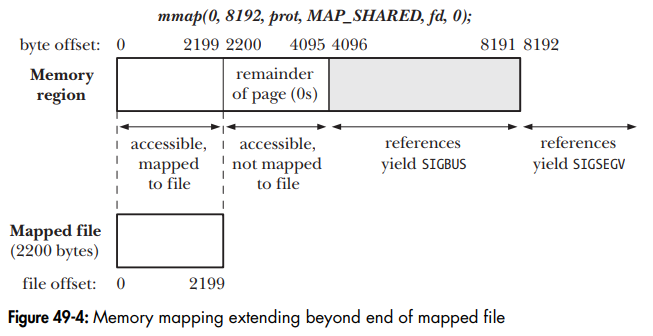

<!-- markdown-toc start - Don't edit this section. Run M-x markdown-toc-refresh-toc -->
**Table of Contents**

- [<2019-05-15 周三>](#2019-05-15-周三)
    - [《The Linux Programming Interface》读书笔记（一）](#the-linux-programming-interface读书笔记一)
        - [关于根目录的`Makefile`的理解](#关于根目录的makefile的理解)
- [<2019-05-17 周五>](#2019-05-17-周五)
    - [《The Linux Programming Interface》读书笔记（二）](#the-linux-programming-interface读书笔记二)
        - [关于根目录的`Makefile.inc`的理解](#关于根目录的makefileinc的理解)
        - [关于`lib`目录下的`Makefile`的理解](#关于lib目录下的makefile的理解)
        - [关于`fileio`目录下的`Makefile`的理解](#关于fileio目录下的makefile的理解)
        - [如何确保使用标准输入（文件描述符`0`）打开一文件](#如何确保使用标准输入文件描述符0打开一文件)
- [<2019-05-20 周一>](#2019-05-20-周一)
    - [《The Linux Programming Interface》读书笔记（三）](#the-linux-programming-interface读书笔记三)
        - [如何用`grep`在文件中查找字符串](#如何用grep在文件中查找字符串)
- [<2019-06-03 周一>](#2019-06-03-周一)
    - [《The Linux Programming Interface》读书笔记（四）](#the-linux-programming-interface读书笔记四)
        - [关于`O_EXCL`的用途](#关于o_excl的用途)
- [<2019-06-20 周四>](#2019-06-20-周四)
    - [《The Linux Programming Interface》读书笔记（五）](#the-linux-programming-interface读书笔记五)
        - [关于`putenv`和`setenv`的使用](#关于putenv和setenv的使用)
        - [关于`setjmp`和`longjmp`的使用](#关于setjmp和longjmp的使用)
        - [关于`setjmp`和`longjmp`的编译器优化问题](#关于setjmp和longjmp的编译器优化问题)
- [<2019-06-21 周五>](#2019-06-21-周五)
    - [《The Linux Programming Interface》读书笔记（六）](#the-linux-programming-interface读书笔记六)
        - [关于`brk`、`sbrk`和`program break`的理解](#关于brksbrk和program-break的理解)
        - [关于`alloca`的使用](#关于alloca的使用)
- [<2019-06-22 周六>](#2019-06-22-周六)
    - [《The Linux Programming Interface》读书笔记（七）](#the-linux-programming-interface读书笔记七)
        - [Set-User-ID and Set-Group-ID Programs](#set-user-id-and-set-group-id-programs)
- [<2019-06-27 周四>](#2019-06-27-周四)
    - [《The Linux Programming Interface》读书笔记（八）](#the-linux-programming-interface读书笔记八)
- [<2019-07-02 周二>](#2019-07-02-周二)
    - [《The Linux Programming Interface》读书笔记（九）](#the-linux-programming-interface读书笔记九)
        - [什么是`Broken-Down Time`](#什么是broken-down-time)
        - [`strftime`和`strptime`](#strftime和strptime)
- [<2019-07-16 周二>](#2019-07-16-周二)
    - [《The Linux Programming Interface》读书笔记（十）](#the-linux-programming-interface读书笔记十)
        - [关于`sigprocmask`的使用](#关于sigprocmask的使用)
- [<2019-09-03 周二>](#2019-09-03-周二)
    - [《The Linux Programming Interface》读书笔记（十一）](#the-linux-programming-interface读书笔记十一)
        - [`exit()`函数的使用（一）](#exit函数的使用一)
        - [Interactions Between `fork()`, `stdio` Buffers, and `_exit()`](#interactions-between-fork-stdio-buffers-and-_exit)
- [<2019-09-05 周四>](#2019-09-05-周四)
    - [《The Linux Programming Interface》读书笔记（十二）](#the-linux-programming-interface读书笔记十二)
        - [将`sig_receiver.c`代码中的`signal()`替换成`sigaction()`](#将sig_receiverc代码中的signal替换成sigaction)
        - [当`pending`的`signal`处理函数变成`SIG_IGN`，程序永远看不到该信号](#当pending的signal处理函数变成sig_ign程序永远看不到该信号)
        - [验证使用`sigaction()`建立信号处理程序时`SA_RESETHAND`和`SA_NODEFER`标志的效果](#验证使用sigaction建立信号处理程序时sa_resethand和sa_nodefer标志的效果)
- [<2019-09-06 周五>](#2019-09-06-周五)
    - [《The Linux Programming Interface》读书笔记（十三）](#the-linux-programming-interface读书笔记十三)
- [<2019-09-07 周六>](#2019-09-07-周六)
    - [《The Linux Programming Interface》读书笔记（十四）](#the-linux-programming-interface读书笔记十四)
        - [关于`setjmp()`和`abort()`的用法](#关于setjmp和abort的用法)
        - [关于`sigsuspend`的理解](#关于sigsuspend的理解)
        - [与信号进行进程间通信](#与信号进行进程间通信)
        - [关于第二十二章的练习（一）](#关于第二十二章的练习一)
            - [第一题，验证`SIGCONT`](#第一题验证sigcont)
- [<2019-09-09 周一>](#2019-09-09-周一)
    - [《The Linux Programming Interface》读书笔记（十五）](#the-linux-programming-interface读书笔记十五)
        - [关于第二十二章的练习（二）](#关于第二十二章的练习二)
            - [第二题，`linux`上标准信号和实时信号谁先被投递](#第二题linux上标准信号和实时信号谁先被投递)
            - [第三题，比较`sigwaitinfo`和`sigsuspend`的执行速度](#第三题比较sigwaitinfo和sigsuspend的执行速度)
- [<2019-09-23 周一>](#2019-09-23-周一)
    - [《The Linux Programming Interface》读书笔记（十六）](#the-linux-programming-interface读书笔记十六)
        - [对`vfork()`的理解](#对vfork的理解)
- [<2019-10-09 周三>](#2019-10-09-周三)
    - [《The Linux Programming Interface》读书笔记（十七）](#the-linux-programming-interface读书笔记十七)
        - [关于第二十四章的练习](#关于第二十四章的练习)
            - [第二题，`vfork()`子进程关闭文件描述符不影响父进程](#第二题vfork子进程关闭文件描述符不影响父进程)
            - [第三题，如何在特定的时间点获得进程的`core dump`，同时让进程继续执行](#第三题如何在特定的时间点获得进程的core-dump同时让进程继续执行)
            - [第五题，子进程等待父进程完成一些操作，如何修改`24-6`的代码](#第五题子进程等待父进程完成一些操作如何修改24-6的代码)
- [<2019-10-10 周四>](#2019-10-10-周四)
    - [《The Linux Programming Interface》读书笔记（十八）](#the-linux-programming-interface读书笔记十八)
        - [26.3.1 Establishing a Handler for `SIGCHLD`](#2631-establishing-a-handler-for-sigchld)
- [<2019-10-11 周五>](#2019-10-11-周五)
    - [《The Linux Programming Interface》读书笔记（十九）](#the-linux-programming-interface读书笔记十九)
        - [关于第二十六章的练习（一）](#关于第二十六章的练习一)
            - [第一题，验证子进程的父进程结束后，它调用`getppid()`返回`1`](#第一题验证子进程的父进程结束后它调用getppid返回1)
            - [第二题，验证父进程何时被`init`进程收养](#第二题验证父进程何时被init进程收养)
- [<2019-10-12 周六>](#2019-10-12-周六)
    - [《The Linux Programming Interface》读书笔记（二十）](#the-linux-programming-interface读书笔记二十)
        - [关于第二十六章的练习（二）](#关于第二十六章的练习二)
            - [第三题，将`procexec/child_status.c`中的`waitpid()`替换为`waitid()`](#第三题将procexecchild_statusc中的waitpid替换为waitid)
        - [对`wait`，`waitpid()`和`waitid()`的理解](#对waitwaitpid和waitid的理解)
- [<2019-10-15 周二>](#2019-10-15-周二)
    - [《The Linux Programming Interface》读书笔记（二十一）](#the-linux-programming-interface读书笔记二十一)
        - [为什么`on_exit()`注册的退出函数在`fork()`子进程中没有被调用](#为什么on_exit注册的退出函数在fork子进程中没有被调用)
        - [关于第二十六章的练习（三）](#关于第二十六章的练习三)
            - [第四题，使用信号同步消除`make_zombie.c`中`system()`前面的`sleep()`的条件竞争](#第四题使用信号同步消除make_zombiec中system前面的sleep的条件竞争)
- [<2019-10-18 周五>](#2019-10-18-周五)
    - [《The Linux Programming Interface》读书笔记（二十二）](#the-linux-programming-interface读书笔记二十二)
        - [关于脚本在`linux`下是如何被当做可执行文件执行的](#关于脚本在linux下是如何被当做可执行文件执行的)
        - [关于`awk`的`-f`参数](#关于awk的-f参数)
- [<2019-10-26 周六>](#2019-10-26-周六)
    - [《The Linux Programming Interface》读书笔记（二十三）](#the-linux-programming-interface读书笔记二十三)
        - [关于第二十九章的练习](#关于第二十九章的练习)
- [<2019-10-31 周四>](#2019-10-31-周四)
    - [《The Linux Programming Interface》读书笔记（二十四）](#the-linux-programming-interface读书笔记二十四)
        - [为什么读进程要关闭管道未使用的写描述符](#为什么读进程要关闭管道未使用的写描述符)
        - [为什么写进程要关闭管道未使用的读描述符](#为什么写进程要关闭管道未使用的读描述符)
- [<2019-11-05 周二>](#2019-11-05-周二)
    - [《The Linux Programming Interface》读书笔记（二十五）](#the-linux-programming-interface读书笔记二十五)
        - [关于第四十四章的练习（一）](#关于第四十四章的练习一)
            - [第二题，实现`popen()`和`pclose()`](#第二题实现popen和pclose)
            - [第三题](#第三题)
- [<2019-11-06 周三>](#2019-11-06-周三)
    - [《The Linux Programming Interface》读书笔记（二十六）](#the-linux-programming-interface读书笔记二十六)
        - [关于第四十四章的练习（二）](#关于第四十四章的练习二)
            - [第四题](#第四题)
- [<2019-11-15 周五>](#2019-11-15-周五)
    - [《The Linux Programming Interface》读书笔记（二十七）](#the-linux-programming-interface读书笔记二十七)
        - [关于第四十六章的练习（一）](#关于第四十六章的练习一)
            - [第二题](#第二题)
- [<2019-11-18 周一>](#2019-11-18-周一)
    - [《The Linux Programming Interface》读书笔记（二十八）](#the-linux-programming-interface读书笔记二十八)
        - [关于第四十六章的练习（二）](#关于第四十六章的练习二)
            - [第四题（一）](#第四题一)
- [<2019-11-19 周二>](#2019-11-19-周二)
    - [《The Linux Programming Interface》读书笔记（二十九）](#the-linux-programming-interface读书笔记二十九)
        - [关于第四十六章的练习（三）](#关于第四十六章的练习三)
            - [第四题（二）](#第四题二)
            - [第五题](#第五题)
- [<2019-11-23 周六>](#2019-11-23-周六)
    - [《The Linux Programming Interface》读书笔记（三十）](#the-linux-programming-interface读书笔记三十)
        - [注意`Makefile`中的代码的位置问题](#注意makefile中的代码的位置问题)
        - [关于第四十八章的练习（一）](#关于第四十八章的练习一)
            - [第一题](#第一题)
- [<2019-11-25 周一>](#2019-11-25-周一)
    - [《The Linux Programming Interface》读书笔记（三十一）](#the-linux-programming-interface读书笔记三十一)
        - [关于第四十九章的练习](#关于第四十九章的练习)
            - [第一题](#第一题-1)
            - [第二题](#第二题-1)
            - [第三题](#第三题-1)
            - [第四题](#第四题-1)
- [<2019-11-27 周三>](#2019-11-27-周三)
    - [《The Linux Programming Interface》读书笔记（三十二）](#the-linux-programming-interface读书笔记三十二)
        - [关于第五十二章的练习（一）](#关于第五十二章的练习一)
            - [第二题](#第二题-2)
            - [第三题](#第三题-2)
- [<2019-11-28 周四>](#2019-11-28-周四)
    - [《The Linux Programming Interface》读书笔记（三十三）](#the-linux-programming-interface读书笔记三十三)
        - [关于第五十二章的练习（二）](#关于第五十二章的练习二)
            - [第六题](#第六题)
        - [关于第五十三章的练习](#关于第五十三章的练习)
            - [第一题](#第一题-2)
        - [关于第五十四章的练习](#关于第五十四章的练习)
            - [第一题](#第一题-3)
- [<2019-11-29 周五>](#2019-11-29-周五)
    - [《The Linux Programming Interface》读书笔记（三十四）](#the-linux-programming-interface读书笔记三十四)
        - [关于第五十七章的练习](#关于第五十七章的练习)
            - [第二题](#第二题-3)
            - [第三题](#第三题-3)
- [<2019-12-02 周一>](#2019-12-02-周一)
    - [《The Linux Programming Interface》读书笔记（三十五）](#the-linux-programming-interface读书笔记三十五)
        - [关于第五十九章的练习](#关于第五十九章的练习)
            - [第一题](#第一题-4)
            - [第二题](#第二题-4)
- [<2019-12-04 周三>](#2019-12-04-周三)
    - [《The Linux Programming Interface》读书笔记（三十六）](#the-linux-programming-interface读书笔记三十六)
        - [如何开启`debian`下的`echo`服务端口](#如何开启debian下的echo服务端口)
- [<2019-12-05 周四>](#2019-12-05-周四)
    - [《The Linux Programming Interface》读书笔记（三十七）](#the-linux-programming-interface读书笔记三十七)
        - [关于`echo`服务端口的`ECONNREFUSED`的错误](#关于echo服务端口的econnrefused的错误)
        - [关于第六十三章的练习（一）](#关于第六十三章的练习一)
            - [第一题](#第一题-5)
            - [第二题](#第二题-5)
            - [第三题](#第三题-4)
- [<2019-12-06 周五>](#2019-12-06-周五)
    - [《The Linux Programming Interface》读书笔记（三十八）](#the-linux-programming-interface读书笔记三十八)
        - [关于第六十三章的练习（二）](#关于第六十三章的练习二)
            - [第五题](#第五题-1)
            - [第八题](#第八题)
- [<2019-12-07 周六>](#2019-12-07-周六)
    - [《The Linux Programming Interface》读书笔记（三十九）](#the-linux-programming-interface读书笔记三十九)
- [<2019-12-09 周一>](#2019-12-09-周一)
    - [《The Linux Programming Interface》读书笔记（四十）](#the-linux-programming-interface读书笔记四十)
- [<2021-04-21 周三>](#2021-04-21-周三)
    - [再读《The Linux Programming Interface》读书笔记（一）](#再读the-linux-programming-interface读书笔记一)
- [<2021-04-22 周四>](#2021-04-22-周四)
    - [再读《The Linux Programming Interface》读书笔记（二）](#再读the-linux-programming-interface读书笔记二)
        - [关于第三章的练习](#关于第三章的练习)
            - [第一题](#第一题-6)
        - [5.1 Atomicity and Race Conditions](#51-atomicity-and-race-conditions)
            - [`O_APPEND`的原子性](#o_append的原子性)
        - [5.3 Open File Status Flags](#53-open-file-status-flags)
- [<2021-04-23 周五>](#2021-04-23-周五)
    - [再读《The Linux Programming Interface》读书笔记（三）](#再读the-linux-programming-interface读书笔记三)
        - [5.6 File `I/O` at a Specified Offset: `pread()` and `pwrite()`](#56-file-io-at-a-specified-offset-pread-and-pwrite)
        - [5.7 Scatter-Gather `I/O`: `readv()` and `writev()`](#57-scatter-gather-io-readv-and-writev)
        - [5.10 `I/O` on Large Files](#510-io-on-large-files)

<!-- markdown-toc end -->

# <2019-05-15 周三>

## 《The Linux Programming Interface》读书笔记（一）

### 关于根目录的`Makefile`的理解

纠结了好几天，因为下载到的`TLPI`的书中代码有自己定义的头文件和很多`Makefile`文件，让我有点望而却步，还真花了近三天的时间去配置`TLPI`的读书环境，这样一来对`Makefile`的理解加深了许多。

所以这里有必要对`Makefile`文件做一些解释，下面是代码所在目录的根目录中的`Makefile`文件内容，后续会随着读书进度对该文件内容进行增加，直到和书中代码提供的`Makefile`内容一样，目前内容如下：

```
DIRS = lib \
	fileio

BUILD_DIRS = ${DIRS}

all:
	@ echo ${BUILD_DIRS}
	@ for dir in ${BUILD_DIRS}; do (cd $${dir}; ${MAKE}); \
		if test $$? -ne 0; then break; fi; done

clean:
	@ for dir in ${BUILD_DIRS}; do (cd $${dir}; ${MAKE} clean); done
```

`lib`目录位于`DIRS`的第一个，表示`lib`目录中的文件将最先被编译；`@`的意思是关闭回显，如果去掉，在运行`make`时将会有如下显示：

```
cho lib fileio
lib fileio
for dir in lib fileio; do (cd ${dir}; make); \
	if test $? -ne 0; then break; fi; done
```

即将`Makefile`中的代码内容打印出来了；`$${dir}`前面的`$$`表示`dir`是一个局部变量，在`shell`编程中局部变量用`$$`修饰；`${MAKE}`是`make`预定义的宏，如果要查看这些宏，请使用`make -p`命令，比如：

```
% make -p | grep MAKE
make: *** No targets specified and no makefile found.  Stop.
MAKE_VERSION := 4.2.1
MAKEFILE_LIST :=
GNUMAKEFLAGS :=
MAKELEVEL := 0
MAKE_HOST := x86_64-pc-linux-gnu
MAKE = $(MAKE_COMMAND)
MAKE_COMMAND := make
MAKEFLAGS = p
MAKEFILES :=
MAKEINFO = makeinfo
MAKE_TERMERR := /dev/pts/2
	$(MAKEINFO) $(MAKEINFO_FLAGS) $< -o $@
	$(MAKEINFO) $(MAKEINFO_FLAGS) $< -o $@
	$(MAKEINFO) $(MAKEINFO_FLAGS) $< -o $@
	$(MAKEINFO) $(MAKEINFO_FLAGS) $< -o $@
	$(MAKEINFO) $(MAKEINFO_FLAGS) $< -o $@
	$(MAKEINFO) $(MAKEINFO_FLAGS) $< -o $@
```

这里的`$$?`是什么意思呢？我没有找到关于`$`的解释，但是根据自测可以得知`$`类似于转义`\`，比如我去掉前面的`@`后从终端打印出来的`shell`代码可以看出，如下：

```
for dir in lib fileio; do (cd ${dir}; make); \
	if test  -ne 0; then break; fi; done
```
```
# 正确输出
for dir in lib fileio; do (cd ${dir}; make); \
	if test $? -ne 0; then break; fi; done
```

`test`后面不是`$?`而是空格，所以我理解是`$$?`执行时变成了`$?`来判断命令的退出状态，`0`表示没有错误，其他任何值表明有错误。

# <2019-05-17 周五>

## 《The Linux Programming Interface》读书笔记（二）

### 关于根目录的`Makefile.inc`的理解

目前`Makefile.inc`的内容如下：

```
# Makefile.inc - common definitions used by all makefiles

TLPI_DIR = ..
TLPI_LIB = ${TLPI_DIR}/libtlpi.a
TLPI_INCL_DIR = ${TLPI_DIR}/lib

IMPL_CFLAGS = -std=c99 -D_XOPEN_SOURCE=600 \
            -D_DEFAULT_SOURCE \
            -g -I${TLPI_INCL_DIR} \
            -pedantic \
            -Wall \
            -W \
            -Wmissing-prototypes \
            -Wno-sign-compare \
            -Wno-unused-parameter

CFLAGS = ${IMPL_CFLAGS}

IMPL_LDLIBS = ${TLPI_LIB}

LDLIBS = ${IMPL_LDLIBS}

RM = rm -f
```

很好理解，但是需要提出一个问题，在运行`make`会有如下的输出：

```
cc -std=c99 -D_XOPEN_SOURCE=600 -D_DEFAULT_SOURCE -g -I../lib -pedantic -Wall -W -Wmissing-prototypes -Wno-sign-compare -Wno-unused-parameter   -c -o get_num.o get_num.c
```

上面输出中的`-c -o get_num.o get_num.c`这部分内容为什么会自动被加入`cc`的选项里？目前我还没有找到答案。

### 关于`lib`目录下的`Makefile`的理解

目前`Makefile`的内容如下：

```
include ../Makefile.inc

all: ${TLPI_LIB}

OBJECTS = $(patsubst %.c, %.o, $(wildcard *.c))

${TLPI_LIB}: ${OBJECTS}
	${RM} ${TLPI_LIB}
	${AR} rs ${TLPI_LIB} *.o

error_functions.o: ename.c.inc

ename.c.inc:
	sh build_ename.sh > ename.c.inc
	echo 1>&2 "ename.c.inc built"

clean:
	${RM} *.o ename.c.inc ${TLPI_LIB}
```

代码中的`patsubst`的作用是将`%.c`改为`%.o`，`wildcard *.c`是搜索当前目录下所有以`.c`结尾的文件，生成一个以空格间隔的文件名列表。

### 关于`fileio`目录下的`Makefile`的理解

目前`Makefile`的内容如下：

```
include ../Makefile.inc

GEN_EXE = copy

LINUX_EXE = large_file

EXE = ${GEN_EXE} ${LINUX_EXE}

all: ${EXE}

allgen: ${GEN_EXE}

clean:
	${RM} ${EXE} *.o

showall:
	@ echo ${EXE}

${EXE}: ${TLPI_LIB}
```

代码中`LINUX_EXE = large_file`这是啥意思？没有找到`large_file`的解释。

### 如何确保使用标准输入（文件描述符`0`）打开一文件

如果调用`open()`成功，必须保证其返回值为进程未用文件描述符中数值最小者，补全书中代码如下：

```
// fileio_test_00.c
#include <fcntl.h>
#include <tlpi_hdr.h>

int main(int argc, char *argv[])
{
  int fd;

  if (close(STDIN_FILENO) == -1) {
    errExit("close");
  }

  fd = open("/home/ysouyno/temp/a.txt", O_RDONLY);
  if (fd == -1) {
    errExit("open");
  }

  printf("fd: %d\n", fd);

  if (close(fd) == -1) {
    errExit("close");
  }

  return 0;
}
```

由于文件描述符`0`未用，所以`open()`调用势必使用此描述符打开文件。测试输出结果：`fd: 0`。

# <2019-05-20 周一>

## 《The Linux Programming Interface》读书笔记（三）

### 如何用`grep`在文件中查找字符串

在附件B中看到了这个用法，比如`grep -- -p t_getopt.c`表示在`t_getopt.c`文件中查找字符串`-p`，必须要使用`--`，不用说，否则`-p`会被当做`grep`的参数处理而无法查找字符串`-p`，如下：

```
% grep -- -p t_getopt.c
  fprintf(stderr, "Usage :%s [-p arg] [-x]\n", prog_name);
    printf("-p was specified with the value \"%s\"\n", pstr);
```

可以直接在文件中查找字符串，如下：

```
% grep stderr t_getopt.c
    fprintf(stderr, "%s (-%c)\n", msg, printable(opt));
  fprintf(stderr, "Usage :%s [-p arg] [-x]\n", prog_name);
```

# <2019-06-03 周一>

## 《The Linux Programming Interface》读书笔记（四）

### 关于`O_EXCL`的用途

书中代码`bad_exclusive_open.c`展示了两个程序都声称自己独家创建了一个文件，代码如下：

```
#include <sys/stat.h>
#include <fcntl.h>
#include "tlpi_hdr.h"

int main(int argc, char *argv[])
{
  int fd;

  if (argc < 2 || strcmp(argv[1], "--help") == 0) {
    usageErr("%s file\n", argv[0]);
  }

  fd = open(argv[1], O_WRONLY); // Open 1: check if file exists
  if (fd != -1) {               // Open succeeded
    printf("[PID %ld] File \"%s\" already exists\n",
           (long)getpid(), argv[1]);
    close(fd);
  }
  else {
    if (errno != ENOENT) {      // Failed for unexpected reason
      errExit("open");
    }
    else {
      printf("[PID %ld] File \"%s\" doesn't exist yet\n",
             (long)getpid(), argv[1]);
      if (argc > 2) {           // Delay between check and create
        sleep(5);               // Suspend execution for 5 seconds
        printf("[PID %ld] Done sleeping\n", (long)getpid());
      }

      fd = open(argv[1], O_WRONLY | O_CREAT, S_IRUSR | S_IWUSR);
      if (fd == -1) {
        errExit("open");
      }

      printf("[PID %ld] Create file \"%s\" exclusively\n",
             (long)getpid(), argv[1]); // MAY NOT BE TRUE!
    }
  }

  exit(EXIT_SUCCESS);
}
```

用到的测试命令为：

```
./bad_exclusive_open tfile sleep &
./bad_exclusive_open tfile
```

我的机器输出如下：

```
-> % ./fileio/bad_exclusive_open tfile sleep &
[1] 6422
[PID 6422] File "tfile" doesn't exist yet

-> % ./fileio/bad_exclusive_open tfile
[PID 6431] File "tfile" doesn't exist yet
[PID 6431] Create file "tfile" exclusively

-> % [PID 6422] Done sleeping
[PID 6422] Create file "tfile" exclusively

[1]  + 6422 done       ./fileio/bad_exclusive_open tfile sleep
```

可添加`O_EXCL`参数来解决这个问题，将`fd = open(argv[1], O_WRONLY | O_CREAT, S_IRUSR | S_IWUSR);`修改为`fd = open(argv[1], O_WRONLY | O_CREAT | O_EXCL, S_IRUSR | S_IWUSR);`，这样代码输出如下：

```
-> % ./fileio/bad_exclusive_open tfile sleep &
[1] 6508
[PID 6508] File "tfile" doesn't exist yet

-> % ./fileio/bad_exclusive_open tfile
[PID 6517] File "tfile" doesn't exist yet
[PID 6517] Create file "tfile" exclusively

-> % [PID 6508] Done sleeping
ERROR [EEXIST File exists] open

[1]  + 6508 exit 1     ./fileio/bad_exclusive_open tfile sleep
```

# <2019-06-20 周四>

## 《The Linux Programming Interface》读书笔记（五）

### 关于`putenv`和`setenv`的使用

每次拿起这本书看看都会困，讲得都是某个函数怎么使用，拿来当参考书还是不错的，比`man`手册页讲得详细。

```
#include <stdlib.h>
int putenv(char *string);
Returns 0 on success, or nonzero on error
```

```
#include <stdlib.h>
int setenv(const char *name, const char *value, int overwrite);
Returns 0 on success, or 1 on error
```

`putenv`和`setenv`的函数的定义如上，它们的区别除了参数表达的意思外，我想说的是`putenv`传入的指针，后续针对参数`string`的修改会影响到环境变量，而`setenv`不会。`setenv`会分配内存并将指针指向的字符串内容拷贝过去。

所以在使用的时候要小心，我好像在`man`手册页上没看到这些内容，所以多看看这本书还是有好处的。

贴上书中的代码如下：

```
// modify_env.c
#define _GNU_SOURCE // To get various declaration from <stdlib.h>
#include <stdlib.h>
#include "tlpi_hdr.h"

extern char **environ;

int main(int argc, char *argv[])
{
  int j;
  char **ep;

  clearenv(); // Erase entire environment

  for (j = 1; j < argc; ++j) {
    if (putenv(argv[j]) != 0) {
      errExit("putenv: %s", argv[j]);
    }
  }

  if (setenv("GREET", "Hello world", 0) == -1) {
    errExit("setenv");
  }

  unsetenv("BYE");

  for (ep = environ; *ep != NULL; ++ep) {
    puts(*ep);
  }

  exit(EXIT_SUCCESS);
}
```
```
% ./modify_env "GREET=ysouyno sun" SHELL=/bin/bash BYE=bye
GREET=ysouyno sun
SHELL=/bin/bash

./modify_env SHELL=/bin/bash BYE=bye
SHELL=/bin/bash
GREET=Hello world
```

### 关于`setjmp`和`longjmp`的使用

原来`linux`的`C`语言还有这种骚操作，类似于`goto`，但是`goto`只能在函数内部进行跳转，而`setjmp`和`longjmp`这两个函数能用于函数间跳转，`setjmp`设置跳转的目的地，`longjmp`跳转到此。正如书上所说，要特别注意：__如果`setjmp`的函数已经调用返回了，再执行`longjmp`的话会产生错误，因为展开堆栈会有问题__。

见代码如下：

```
// longjmp.c
#include <setjmp.h>
#include "tlpi_hdr.h"

static jmp_buf env;

static void f2()
{
  longjmp(env, 2);
}

static void f1(int argc)
{
  if (argc == 1) {
    longjmp(env, 1);
  }

  f2();
}

int main(int argc, char *argv[])
{
  switch (setjmp(env)) {
  case 0: // This is the return after the initial setjmp()
    printf("Calling f1() after initial setjmp()\n");
    f1(argc);
    break;
  case 1:
    printf("We jumped back from f1()\n");
    break;
  case 2:
    printf("We jumped back from f2()\n");
    break;
  }

  exit(EXIT_SUCCESS);
}
```
```
% ./longjmp
Calling f1() after initial setjmp()
We jumped back from f1()

% ./longjmp x
Calling f1() after initial setjmp()
We jumped back from f2()
```

### 关于`setjmp`和`longjmp`的编译器优化问题

这两个函数还是尽量不要使用，因为编译器优化会带来的很大的问题，如果要使用这两个函数，内部涉及跳转的变量请使用`volatile`关键字来修饰，因为这样可以防止编译器优化。如下面的代码所示：

```
// setjmp_var.c
#include <stdio.h>
#include <stdlib.h>
#include <setjmp.h>

static jmp_buf env;

static void doJump(int nvar, int rvar, int vvar)
{
  printf("Inside doJump(): nvar = %d rvar = %d vvar = %d\n",
         nvar, rvar, vvar);
  longjmp(env, 1);
}

int main(int argc, char *argv[])
{
  int nvar;
  register int rvar;      // Allocated in register if possible
  volatile int vvar;

  nvar = 111;
  rvar = 222;
  vvar = 333;

  if (setjmp(env) == 0) { // Code executed after setjmp()
    nvar = 777;
    rvar = 888;
    vvar = 999;
    doJump(nvar, rvar, vvar);
  }
  else {                  // Code executed after longjmp()
    printf("After longjmp(): nvar = %d rvar = %d vvar = %d\n",
           nvar, rvar, vvar);
  }

  exit(EXIT_SUCCESS);
}
```
```
% cc -o setjmp_vars setjmp_vars.c

% ./setjmp_vars
Inside doJump(): nvar = 777 rvar = 888 vvar = 999
After longjmp(): nvar = 777 rvar = 222 vvar = 999
```
```
% cc -O -o setjmp_vars setjmp_vars.c

% ./setjmp_vars
Inside doJump(): nvar = 777 rvar = 888 vvar = 999
After longjmp(): nvar = 111 rvar = 222 vvar = 999
```

从上面代码可以看到只有`volatile`修饰的`vvar`变量没有变化，因为`volatile`明确指明不需要编译器优化此变量，才使得`vvar`是我们期望的值。

书上说可以通过添加`-Wextra`产生有用的编译器警告信息，但是我的显示却是这样的，说明这本书有点久远了。

```
% cc -Wall -Wextra -O -o setjmp_vars setjmp_vars.c
setjmp_vars.c: In function 'main':
setjmp_vars.c:14:14: warning: unused parameter 'argc' [-Wunused-parameter]
 int main(int argc, char *argv[])
          ~~~~^~~~
setjmp_vars.c:14:26: warning: unused parameter 'argv' [-Wunused-parameter]
 int main(int argc, char *argv[])
                    ~~~~~~^~~~~~
```

可以使用`make`产生了有用的警告信息，如下：

```
setjmp_vars.c: In function 'main':
setjmp_vars.c:17:16: warning: variable 'rvar' might be clobbered by 'longjmp' or 'vfork' [-Wclobbered]
   register int rvar;      // Allocated in register if possible
                ^~~~
```

# <2019-06-21 周五>

## 《The Linux Programming Interface》读书笔记（六）

### 关于`brk`、`sbrk`和`program break`的理解

这篇文章我觉得讲得不错“[虚拟内存探究 -- 第四篇: malloc, heap & the program break](https://cloud.tencent.com/developer/article/1198231)”。

当程序刚开始初始化的时候`program break`是指向`the uninitialized data segment`的结束处，如果程序中有调用`malloc`从堆上分配内存，则对于刚初始化的程序而言必须增加`program break`的位置，这样`malloc`就可以在`the end of the uninitialized data segment`和新的`program break`之间申请内存了，这部分操作可能是被放在了`malloc`函数内部实现的，通过调用`brk`和`sbrk`系统调用来实现的。

> Resizing the heap (i.e., allocating or deallocating memory) is actually as simple as telling the kernel to adjust its idea of where the process’s program break is.

引用文章中的图片：


按照文章的介绍我使用了`strace`来跟踪系统调用情况，有如下输出：

```
write(1, "BEFORE MALLOC\n", 14BEFORE MALLOC
)         = 14
brk(NULL)                               = 0x55fee314b000
brk(0x55fee316c000)                     = 0x55fee316c000
write(1, "AFTER MALLOC\n", 13AFTER MALLOC
)          = 13
```

可以结合书中的代码加以理解，如下代码展示了当程序内存释放后`program break`发生了什么，如下：

```
// free_and_sbrk.c
#include "tlpi_hdr.h"

#define MAX_ALLOCS 1000000

int main(int argc, char *argv[])
{
  char *ptr[MAX_ALLOCS];
  int free_step, free_min, free_max, block_size, num_allocs, j;

  if (argc < 3 || strcmp(argv[1], "--help") == 0) {
    usageErr("%s num-allocs block-size [step [min [max]]]\n", argv[0]);
  }

  num_allocs = getInt(argv[1], GN_GT_0, "num-allocs");
  if (num_allocs > MAX_ALLOCS) {
    cmdLineErr("num-allocs > %d\n", MAX_ALLOCS);
  }

  block_size = getInt(argv[2], GN_GT_0 | GN_ANY_BASE, "block-size");

  free_step = (argc > 3) ? getInt(argv[3], GN_GT_0, "step") : 1;
  free_min  = (argc > 4) ? getInt(argv[4], GN_GT_0, "min") : 1;
  free_max  = (argc > 5) ? getInt(argv[5], GN_GT_0, "max") : num_allocs;

  if (free_max > num_allocs) {
    cmdLineErr("free-max > num-allocs\n");
  }

  printf("Initial program break:           %10p\n", sbrk(0));

  printf("Allocating %d*%d bytes\n", num_allocs, block_size);

  for (j = 0; j < num_allocs; ++j) {
    ptr[j] = malloc(block_size);
    if (ptr[j] == NULL) {
      errExit("malloc");
    }
  }

  printf("Program break is now:            %10p\n", sbrk(0));

  printf("Freeing blocks from %d to %d in steps of %d\n",
         free_min, free_max, free_step);

  for (j = free_min - 1; j < free_max; j += free_step) {
    free(ptr[j]);
  }

  printf("After free(), program break is : %10p\n", sbrk(0));

  exit(EXIT_SUCCESS);
}
```

从下面两种输出来看`program break`并没有改变

```
% ./free_and_sbrk 1000 10240 2
Initial program break:           0x55eaf7dc8000
Allocating 1000*10240 bytes
Program break is now:            0x55eaf87b1000
Freeing blocks from 1 to 1000 in steps of 2
After free(), program break is : 0x55eaf87b1000

% ./free_and_sbrk 1000 10240 1 1 999
Initial program break:           0x555ec439a000
Allocating 1000*10240 bytes
Program break is now:            0x555ec4d83000
Freeing blocks from 1 to 999 in steps of 1
After free(), program break is : 0x555ec4d83000
```

但是下面这个输出，将申请的`1000`个内存的最后`500`个全部释放了，`program break`也跟着变小了，说明系统回收了部分，整个程序的堆变小了又，如下输出：

```
% ./free_and_sbrk 1000 10240 1 500 1000
Initial program break:           0x55e29c454000
Allocating 1000*10240 bytes
Program break is now:            0x55e29ce3d000
Freeing blocks from 500 to 1000 in steps of 1
After free(), program break is : 0x55e29c956000
```

### 关于`alloca`的使用

原来还有可以在栈上分配内存的函数，这就是`alloca`，比较好奇的是要在什么情况下可以使用它呢？看完原文这段话就会理解了：

> Using `alloca()` can be especially useful if we employ `longjmp()` (Section 6.8) or `siglongjmp()` (Section 21.2.1) to perform a nonlocal goto from a signal handler. In this case, it is difficult or even impossible to avoid memory leaks if we allocated memory in the jumped-over functions using `malloc()`. By contrast, `alloca()` avoids this problem completely, since, as the stack is unwound by these calls, the allocated memory is automatically freed.

同时`alloca`使用时必须注意不能做为函数的参数，在我的理解就是函数参数是分配在栈上的，此时函数还没有调用，栈空间还不知道在哪里呢？您将`alloca`做为参数传入，那么`alloca`的内存要分配哪里？正确的使用如下：

```
void *y;
y = alloca(size);
func(x, y, z);
```

# <2019-06-22 周六>

## 《The Linux Programming Interface》读书笔记（七）

### Set-User-ID and Set-Group-ID Programs

这本书原来不打算再看了，一看就困，感觉好浅。其实还是有必要看的，我没有我自己认为的那样懂`linux`系统，比如这个标题我就是完全陌生，感觉好恐怖！

原版英文看得不太懂，拿代码中的`check_password.c`这个程序来举例，正如书上的一样，如果我以我的登录用户名`ysouyno`直接执行的话，会显示如下错误：

```
% ./check_password
Username: ysouyno
ERROR: no permisson to read shadow password file
```

那么这里就需要使用`chmod u+s`来将`check_password`设置为`Set-User-ID`程序了，如下的一系列命令的输出：

```
% su
Password:

# chown root check_password

# ls -l
total 60
-rw-r--r-- 1 ysouyno ysouyno   302 Jun 22 08:23 Makefile
-rwxr-xr-x 1 root    ysouyno 35232 Jun 22 10:35 check_password
-rw-r--r-- 1 ysouyno ysouyno  1815 Jun 22 08:23 check_password.c
-rw-r--r-- 1 ysouyno ysouyno 15360 Jun 22 10:35 check_password.o

# chmod u+s check_password
# ls -l
total 60
-rw-r--r-- 1 ysouyno ysouyno   302 Jun 22 08:23 Makefile
-rwsr-xr-x 1 root    ysouyno 35232 Jun 22 10:35 check_password
-rw-r--r-- 1 ysouyno ysouyno  1815 Jun 22 08:23 check_password.c
-rw-r--r-- 1 ysouyno ysouyno 15360 Jun 22 10:35 check_password.o

# exit
exit

% ./check_password
Username: ysouyno
Password:
Successfully authenticated: UID=1000
```

注意到此时`check_password`的权限从`-rwxr-xr-x`变成了`-rwsr-xr-x`，同时必须注意这里首先使用`chown`将`check_password`的所有者变成`root`，因为当`Set-User-ID`程序`check_password`执行时程序就具有文件所有者的权限，即`root`权限。

# <2019-06-27 周四>

## 《The Linux Programming Interface》读书笔记（八）

决定暂时还是将这本书终止，不再看了，目前看到第234页。不想继续看的原因是书中所讲的内容不能吸引我，看得好累好困，今天一天一直都在被这本书催眠。

目前看到的第10章，讲的是时间，15章居然讲文件属性，我的天，我还看到书上教你如何使用`mount`命令。

# <2019-07-02 周二>

## 《The Linux Programming Interface》读书笔记（九）

还是重新把这本书拣起来再看吧，因为我去找了其它关于`linux`的书，其中有一本叫做《Linux系统编程》，里面所讲解的内容与《The Linux Programming Interface》差不多，都讲时间、用户、属性等，相比之下还不如《The Linux Programming Interface》这本书讲得好呢，所以还是继续来读这本书。

### 什么是`Broken-Down Time`

英文原文看起来是好，单词都认识，但是组合在一起就不知道是啥意思了，比如：`Broken-Down Time`，书看着看着就知道`Broken-Down Time`是啥意思了。因为书中在第十章`Time`首先讲的函数是`gettimeofday`和`time`，它们返回的其实都是秒数（类型`time_t`），即`Returns number of seconds since the Epoch`。继续向下看，当讲到`gmtime`和`localtime`时就讲到将`time_t`类型变成结构体`tm`（这就是`Broken-Down Time`），因为`tm`中成员都被分解成比如年、月、日这样的成员。那么现在就好理解什么是`Broken-Down Time`了。

```
// calendar_time.c
#include <locale.h>
#include <time.h>
#include <sys/time.h>
#include "tlpi_hdr.h"

#define SECONDS_IN_TROPICAL_YEAR (365.24219 * 24 *60 * 60)

int main(int argc, char *argv[])
{
  time_t t;
  struct tm *gmp, *locp;
  struct tm gm, loc;
  struct timeval tv;

  t = time(NULL);
  printf("Seconds sine the Epoch (1 Jan 1970): %ld", (long)t);
  printf("(about %6.3f years)\n", t / SECONDS_IN_TROPICAL_YEAR);

  if (gettimeofday(&tv, NULL) == -1) {
    errExit("gettimeofday");
  }

  printf("  gettimeofday() returned %ld secs, %ld microsecs\n",
         (long)tv.tv_sec, (long)tv.tv_usec);

  gmp = gmtime(&t);
  if (gmp == NULL) {
    errExit("gmtime");
  }

  // Save local copy, since *gmp may be modified by asctime() or gmtime()
  gm = *gmp;
  printf("Broken down by gmtime():\n");
  printf("  year=%d mon=%d mday=%d hour=%d min=%d sec=%d ", gm.tm_year,
         gm.tm_mon, gm.tm_mday, gm.tm_hour, gm.tm_min, gm.tm_sec);
  printf("wday=%d yday=%d isdst=%d\n", gm.tm_wday, gm.tm_yday, gm.tm_isdst);

  locp = localtime(&t);
  if (locp == NULL) {
    errExit("localtime");
  }

  // Save local copy
  loc = *locp;
  printf("Broken down by localtime():\n");
  printf("  year=%d mon=%d mday=%d hour=%d min=%d sec=%d ",
         loc.tm_year, loc.tm_mon, loc.tm_mday,
         loc.tm_hour, loc.tm_min, loc.tm_sec);
  printf("wday=%d yday=%d isdst=%d\n\n",
         loc.tm_wday, loc.tm_yday, loc.tm_isdst);

  printf("asctime() formats the gmtime() value as: %s", asctime(&gm));
  printf("ctime() formats the time() value as:     %s", ctime(&t));

  printf("mktime() of gmtime() value:    %ld secs\n", (long)mktime(&gm));
  printf("mktime() of localtime() value: %ld secs\n", (long)mktime(&loc));

  exit(EXIT_SUCCESS);
}
```
```
% ./time/calendar_time
Seconds sine the Epoch (1 Jan 1970): 1562047518(about 49.499 years)
  gettimeofday() returned 1562047518 secs, 228426 microsecs
Broken down by gmtime():
  year=119 mon=6 mday=2 hour=6 min=5 sec=18 wday=2 yday=182 isdst=0
Broken down by localtime():
  year=119 mon=6 mday=2 hour=14 min=5 sec=18 wday=2 yday=182 isdst=0

asctime() formats the gmtime() value as: Tue Jul  2 06:05:18 2019
ctime() formats the time() value as:     Tue Jul  2 14:05:18 2019
mktime() of gmtime() value:    1562018718 secs
mktime() of localtime() value: 1562047518 secs
```

下图可以很明白的了解各种时间函数的关系：


### `strftime`和`strptime`

这两个函数可能不常用到吧，但是书中代码都抄下来了。

```
// strtime.c
#define _XOPEN_SOURCE
#include <time.h>
#include <locale.h>
#include "tlpi_hdr.h"

#define SBUF_SIZE 1000

int main(int argc, char *argv[])
{
  struct tm tm;
  char sbuf[SBUF_SIZE];
  char *ofmt;

  if (argc < 3 || strcmp(argv[1], "--help") == 0) {
    usageErr("%s input-date-time in-format [out-format]\n", argv[0]);
  }

  if (setlocale(LC_ALL, "") == NULL) {
    errExit("setlocale"); // Use locale settings in conversions
  }

  memset(&tm, 0, sizeof(struct tm)); // Initialize 'tm'

  if (strptime(argv[1], argv[2], &tm) == NULL) {
    fatal("strptime");
  }

  // Not set by strptime(); tells mktime() to determine if DST is in effect
  tm.tm_isdst = -1;

  printf("calendar time (seconds since Epoch): %ld\n", (long)mktime(&tm));

  ofmt = argc > 3 ? argv[3] : "%H:%M:%S %A, %d %B %Y %Z";
  if (strftime(sbuf, SBUF_SIZE, ofmt, &tm) == 0) {
    fatal("strftime returned 0");
  }

  printf("strftime() yield: %s\n", sbuf);

  exit(EXIT_SUCCESS);
}
```
```
% ./strtime "9:39:46pm 1 Feb 2011" "%I:%M:%S%p %d %b %Y"
calendar time (seconds since Epoch): 1296567586
strftime() yield: 21:39:46 Tuesday, 01 February 2011 CST

% ./strtime "9:39:46pm 1 Feb 2011" "%I:%M:%S%p %d %b %Y" "%F %T"
calendar time (seconds since Epoch): 1296567586
strftime() yield: 2011-02-01 21:39:46
```

# <2019-07-16 周二>

## 《The Linux Programming Interface》读书笔记（十）

### 关于`sigprocmask`的使用

原来是不准备写这篇笔记的，本来就是很简单的尝试一下，没有啥好写的，但实际情况跟我的预期不一致。代码的意思是使用`sigprocmask`将`SIGINT`阻止，最后再放开，但是我没有等来`Unblocking SIGINT...`输出，因为在`SIGINT`放开后，`SIGINT`被立刻发递送给进程了。代码如下：

```
// signals_test_00.c
#include <signal.h>
#include "tlpi_hdr.h"

int main(int argc, char *argv[])
{
  sigset_t block_set, prev_mask;

  // Initialize a signal set to contain SIGINT
  sigemptyset(&block_set);
  sigaddset(&block_set, SIGINT);

  // Block SIGINT, save previous signal mask
  if (sigprocmask(SIG_BLOCK, &block_set, &prev_mask) == -1) {
    errExit("sigprocmask1");
  }

  // Code that should not be interrupted by SIGINT
  printf("Blocking SIGINT...\n");
  sleep(10);

  // Restore previous signal mask, unblocking SIGINT
  if (sigprocmask(SIG_SETMASK, &prev_mask, NULL) == -1) {
    errExit("sigprocmask2");
  }

  printf("Unblocking SIGINT...\n");
  sleep(5);

  exit(EXIT_SUCCESS);
}
```

```
% ./test/signals_test_00
Blocking SIGINT...
^C^C^C^C^C^C^C^C^C^C^C^C^C

% ./test/signals_test_00
Blocking SIGINT...
Unblocking SIGINT...
^C
```

因此有如下的两种输出情况，第一种情况是在`Blocking SIGINT...`后按`CTRL+C`，因此没有`Unblocking SIGINT...`，而第二个情况在`Unblocking SIGINT...`按`CTRL+C`，程序立即退出了。引用原文：

> SUSv3 specifies that if any pending signals are unblocked by a call to sigprocmask(), then at least one of those signals will be delivered before the call returns. In other words, if we unblock a pending signal, it is delivered to the process immediately.

# <2019-09-03 周二>

## 《The Linux Programming Interface》读书笔记（十一）

### `exit()`函数的使用（一）

> SUSv3 states that if an exit handler itself calls exit(), the results are undefined. On Linux, the remaining exit handlers are invoked as normal. However, on some systems, this causes all of the exit handlers to once more be invoked, which can result in an infinite recursion (until a stack overflow kills the process). Portable applications should avoid calling exit() inside an exit handler.

所以这里要注意，因为在`exit handler`中调用`exit()`有可能引起堆栈溢出。

### Interactions Between `fork()`, `stdio` Buffers, and `_exit()`

这段代码还是比较有意思，如下：

```
// procexec/fork_stdio_buf.c
#include "tlpi_hdr.h"

int main(int argc, char *argv[])
{
  printf("Hello world\n");
  write(STDOUT_FILENO, "Cao\n", 4);

  if (fork() == -1) {
    errExit("fork");
  }

  // Both child and parent continue execution here

  exit(EXIT_SUCCESS);
}
```

```
% ./fork_stdio_buf
Hello world
Cao

% ./fork_stdio_buf > a
% cat a
Cao
Hello world
Hello world
```

> To understand why the message written with `printf()` appears twice, recall that the stdio buffers are maintained in a process’s user-space memory (refer to Section 13.2). Therefore, these buffers are duplicated in the child by `fork()`. When standard output is directed to a terminal, it is line-buffered by default, with the result that the newline-terminated string written by `printf()` appears immediately. However, when standard output is directed to a file, it is `block-buffered` by default. Thus, in our example, the string written by `printf()` is still in the parent’s stdio buffer at the time of the `fork()`, and this string is duplicated in the child. When the parent and the child later call `exit()`, they both flush their copies of the stdio buffers, resulting in duplicate output.

> The output of the `write()` in the program in Listing 25-2 doesn’t appear twice, because `write()` transfers data directly to a kernel buffer, and this buffer is not duplicated during a `fork()`.

> By now, the reason for the second strange aspect of the program’s output when redirected to a file should be clear. The output of `write()` appears before that from `printf()` because the output of `write()` is immediately transferred to the kernel buffer cache, while the output from `printf()` is transferred only when the stdio buffers are flushed by the call to `exit()`. (In general, care is required when mixing stdio functions and system calls to perform I/O on the same file, as described in Section 13.7.)

# <2019-09-05 周四>

## 《The Linux Programming Interface》读书笔记（十二）

发现前面关于`signal`的章节看得不仔细，下面的内容没办法再继续了，所以今天再重新学习一下`signal`，从第二十章开始，所以我认真的做了它的练习，除了最后一题：“Implement siginterrupt() using sigaction().”，因为我没看懂`siginterrupt()`函数的用处。练习的代码没有写得那么完美，所以我用笔记来解释一下关于练习的代码。

### 将`sig_receiver.c`代码中的`signal()`替换成`sigaction()`

这个练习很简单，声明一个`sigaction`变量，并初始化它，然后使用`sigaction()`函数，代码片断如下：

```
struct sigaction sa;

sa.sa_handler = handler;
sigemptyset(&sa.sa_mask);
sa.sa_flags = 0;

for (n = 1; n < NSIG; ++n) { // Same handler for all signals
  sigaction(n, &sa, NULL);
}
```

这里的`sa.sa_flags = 0;`我不知道是不是对的，因为感觉用不到`sa_flags`，所以这设置为`0`，代码运行的很好，效果与`sig_receiver.c`效果相同，所以这里我自认为我做对了。

### 当`pending`的`signal`处理函数变成`SIG_IGN`，程序永远看不到该信号

我写的代码如下：

```
//exercises/20_02.c
#include <signal.h>
#include "tlpi_hdr.h"

static void handler(int sig)
{
  // UNSAFE: This handler uses non-async-signal-safe functions
  // (printf(), exit(); see Section 21.1.2)

  if (sig == SIGINT) {
    printf("Caught SIGINT\n");
  }
}

int main(int argc, char *argv[])
{
  sigset_t block_set, prev_mask;
  struct sigaction sa;

  // or replace SIG_IGN with handler, the program can
  // see SIGINT after unblock SIGINT
  sa.sa_handler = SIG_IGN;
  sigemptyset(&sa.sa_mask);
  sa.sa_flags = 0;

  if (sigaction(SIGINT, &sa, NULL) == -1) {
    errExit("sigaction");
  }

  // Initialize a signal set to contain SIGINT
  sigemptyset(&block_set);
  sigaddset(&block_set, SIGINT);

  // Block SIGINT, save previous signal mask

  if (sigprocmask(SIG_BLOCK, &block_set, &prev_mask) == -1) {
    errExit("sigprocmask");
  }

  printf("Blocking SIGINT 10 seconds...\n");
  sleep(10);

  if (sigprocmask(SIG_SETMASK, &prev_mask, NULL) == -1) {
    errExit("sigprocmask");
  }

  exit(EXIT_SUCCESS);
}
```

代码想表述的意思是这样的：首先使用`sigaction()`函数来设置信号的处理函数，如果想看到效果需要自己修改代码，目前是`sa.sa_handler = SIG_IGN;`，即，使用`SIG_IGN`来忽略信号处理函数，如何演示呢？当程序运行时会调用`sigprocmask`将`SIGINT`变为`pending`，有十秒的时间可以操作，按下键盘的`CTRL+C`发出`SIGINT`，因为此时`SIGINT`是`pending`的，所以看不到任何输出，当十秒钟结束时调用`sigprocmask`取消对`SIGINT`的`pending`，此时被`pending`的`SIGINT`会立即发送给程序，因为设置了`SIG_IGN`，所以此时同样不会有任何输出，这是因为`SIGINT`被`SIG_IGN`忽略掉了。如果将`sa.sa_handler = SIG_IGN;`修改为`sa.sa_handler = handler;`，则十秒钟过后会看到输出`^CCaught SIGINT`。

### 验证使用`sigaction()`建立信号处理程序时`SA_RESETHAND`和`SA_NODEFER`标志的效果

代码如下：

```
// exercises/20_03.c
#include <signal.h>
#include "tlpi_hdr.h"

static void handler(int sig)
{
  sigset_t prev_mask;

  // UNSAFE: This handler uses non-async-signal-safe functions
  // (printf(), exit(); see Section 21.1.2)

  if (sig == SIGINT) {
    printf("Caught SIGINT\n");
    return;
  }

  if (sig == SIGQUIT) {
    printf("Caught SIGQUIT\n");
    exit(EXIT_SUCCESS);
  }

  if (sig == SIGUSR1) {
    printf("Caught SIGUSR1\n");

    if (sigprocmask(SIG_SETMASK, NULL, &prev_mask)) {
      errExit("sigprocmask");
    }

    if (sigismember(&prev_mask, sig)) {
      printf("SIGUSR1 in signal mask\n");
    }
    else {
      printf("SIGUSR1 NOT in signal mask\n");
    }
  }
}

int main(int argc, char *argv[])
{
  struct sigaction sa;

  sa.sa_handler = handler;
  sigemptyset(&sa.sa_mask);
  sa.sa_flags = SA_RESETHAND;

  if (sigaction(SIGINT, &sa, NULL) == -1) {
    errExit("sigaction");
  }

  sa.sa_flags = 0;
  if (sigaction(SIGQUIT, &sa, NULL) == -1) {
    errExit("sigaction");
  }

  sa.sa_flags = SA_NODEFER;
  if (sigaction(SIGUSR1, &sa, NULL) == -1) {
    errExit("sigaction");
  }

  for (; ; ) {
    pause();
  }
}
```

`SA_RESETHAND`的用处我看下面的英文不是太明白，试了一下知道了它的意思，可能`SA_ONESHOT`更好理解一点儿，即，对于设置了`SA_RESETHAND`的信号处理函数，只会被调用一次，如何演示上面程序，需要配合`signals/sig_sender.c`程序，发送`SIGINT`需要两次才会成功，输出如下：（也可以直接发送一万次，这样只需要运行一次命令就可以了）

```
% ./exercises/20_03 &
[1] 19704

% ./signals/sig_sender 19704 10000 2
./signals/sig_sender: sending signals 2 to process 19704 10000 times
Caught SIGINT
[1]  + 19704 interrupt  ./exercises/20_03
ERROR [ESRCH No such process] kill

% ./exercises/20_03 &
[1] 19733

% ./signals/sig_sender 19733 100 2
./signals/sig_sender: sending signals 2 to process 19733 100 times
./signals/sig_sender: exiting
Caught SIGINT

% ps -e | grep 20_03
19733 pts/2    00:00:00 20_03

% ./signals/sig_sender 19733 100 2
./signals/sig_sender: sending signals 2 to process 19733 100 times
./signals/sig_sender: exiting
[1]  + 19733 interrupt  ./exercises/20_03
```

`SA_NODEFER`的用处很好理解，即书中已经说过，对于`sigaction`建立的信号处理函数被调用时`sa_mask`中设置的信号集的所有信号会被阻塞，即自动加入到进程的`signal mask`中，当信号处理函数返回后，`sa_mask`信息集中的信号会从进程`signal mask`中移除。除了`sa_mask`中规定的信号被加入到进程的`signal mask`中，当前造成信号函数被调用的那个信号也会被自动加入到进程的`signal mask`中，所以这里`SA_NODEFER`的用处就在这里，即当对某信号设置了`SA_NODEFER`后，信号处理函数被调用时该信号不会被自动加入到进程的`signal mask`中，对于`sa_mask`的英文解释如下：

> The `sa_mask` field defines a set of signals that are to be blocked during invocation of the handler defined by `sa_handler`. When the signal handler is invoked, any signals in this set that are not currently part of the process signal mask are automatically added to the mask before the handler is called. These signals remain in the process signal mask until the signal handler returns, at which time they are automatically removed. The `sa_mask` field allows us to specify a set of signals that aren’t permitted to interrupt execution of this handler. In addition, the signal that caused the handler to be invoked is automatically added to the process signal mask. This means that a signal handler won’t recursively interrupt itself if a second instance of the same signal arrives while the handler is executing. Because blocked signals are not queued, if any of these signals are repeatedly generated during the execution of the handler, they are (later) delivered only once.

所以对于`SA_NODEFER`的测试我只能用`sigprocmask`和`sigismember`来完成，需要修改代码，如果使用`SA_NODEFER`的话，程序输出是这样的：

```
./exercises/20_03 &
[1] 19787

% ./signals/sig_sender 19787 100 10
./signals/sig_sender: sending signals 10 to process 19787 100 times
./signals/sig_sender: exiting
Caught SIGUSR1
SIGUSR1 NOT in signal mask
```

如果不使用`SA_NODEFER`，则程序的输出是这样的：

```
% ./exercises/20_03 &
[1] 19902

% ./signals/sig_sender 19902 100 10
./signals/sig_sender: sending signals 10 to process 19902 100 times
./signals/sig_sender: exiting
Caught SIGUSR1
SIGUSR1 in signal mask
```

从上面的输出可以看到区别，贴上`SA_RESETHAND`和`SA_NODEFER`的英文解释：

> `SA_RESETHAND`:<br>
When this signal is caught, reset its disposition to the default (i.e., `SIG_DFL`) before invoking the handler. (By default, a signal handler remains established until it is explicitly disestablished by a further call to `sigaction()`.) The name `SA_ONESHOT` is provided as a historical synonym for `SA_RESETHAND`, but the latter name is preferable because it is standardized in SUSv3.

> `SA_NODEFER`:<br>
When this signal is caught, don’t automatically add it to the process signal mask while the handler is executing. The name `SA_NOMASK` is provided as a historical synonym for `SA_NODEFER`, but the latter name is preferable because it is standardized in SUSv3.

# <2019-09-06 周五>

## 《The Linux Programming Interface》读书笔记（十三）

关于再读信号的相关内容时发现第二十章很快读完了，但是第二十一章读起来相当慢（主要关于信号处理函数的内容），同时发现在第二十一章中有许多关键的知识点需要摘录一下，以方便将来的回顾。

> There are various other ways of terminating a signal handler:<br>
1. Use `_exit()` to terminate the process. Beforehand, the handler may carry out some cleanup actions. Note that we can’t use `exit()` to terminate a signal handler, because it is not one of safe functions listed in Table 21-1. It is unsafe because it flushes stdio buffers prior to calling `_exit()`, as described in Section 25.1.<br>
2. Use `kill()` or `raise()` to send a signal that kills the process (i.e., a signal whose default action is process termination).<br>
3. Perform a nonlocal goto from the signal handler.<br>
4. Use the `abort()` function to terminate the process with a core dump.<br>

关于第一点呢我好像理解了，它的意思是，因为`exit()`函数不是`async-signal-safe`，而`_exit()`是`async-signal-safe`，所以要使用`_exit()`来结束进程。因为我看过后面的章节，了解了`exit()`和`_exit()`的区别（`exit()`会做一些额外的工作，然后冲洗`stdio`缓冲区，最后调用`_exit()`函数），联想到`printf()`也不是`async-signal-safe`函数，所有跟`stdio`缓冲区相关的函数好像都不是`async-signal-safe`函数，书中有这么一段话可以看出：

> Although `printf()` is not async-signal-safe, we use it in signal handlers in various example programs in this book. We do so because `printf()` provides an easy and concise way to demonstrate that a signal handler has been called, and to display the contents of relevant variables within the handler. For similar reasons, we occasionally use a few other unsafe functions in signal handlers, including other stdio functions and `strsignal()`.

关于第三点的意思应该是可以从信号处理函数跳出，使用`setjmp()`和`longjmp()`来实现一个非局部的跳转，但是这个方法有一个问题，就是因为当执行信号处理函数时，在`sigaction.sa_mask`中的信号会自动被加入到进程的`signal mask`中，当信号处理函数返回后，它们会被从进程的`signal mask`中移除，如果使用`longjmp()`跳出信号处理函数的话对于不同的`linux`处理不同，`linux`遵循`System V`的行为，即，`linux`不恢复进程的`signal mask`，这样`longjmp()`后，`sa_mask`的信号仍然被阻塞，参考原文：

> What happens to the signal mask if we exit the signal handler using `longjmp()`? The answer depends on the genealogy of the particular UNIX implementation. Under System V, `longjmp()` doesn’t restore the signal mask, so that blocked signals are not unblocked upon leaving the handler. Linux follows the System V behavior. (This is usually not what we want, since it leaves the signal that caused invocation of the handler blocked.) Under BSD-derived implementations, `setjmp()` saves the signal mask in its env argument, and the saved signal mask is restored by `longjmp()`. (BSD-derived implementations also provide two other functions, `_setjmp()` and `_longjmp()`, which have the System V semantics.) In other words, we can’t portably use `longjmp()` to exit a signal handler.

当然可以使用`_BSD_SOURCE`宏来控制`setjmp()`和`longjmp()`的行为，如下：

> If we define the `_BSD_SOURCE` feature test macro when compiling a program, then (the glibc) `setjmp()` follows the BSD semantics.

因此`POSIX.1-1990`有了这两个函数`sigsetjmp()`和`siglongjmp()`。

# <2019-09-07 周六>

## 《The Linux Programming Interface》读书笔记（十四）

### 关于`setjmp()`和`abort()`的用法

之前看书不太仔细，对于`setjmp`不能使用赋值语句的问题我居然毫无印象，见原书135页（PDF的179页）：

```
s = setjmp(env); /* WRONG! */
```

> These restrictions are specified because an implementation of `setjmp()` as a conventional function can’t be guaranteed to have enough information to be able to save the values of all registers and temporary stack locations used in an enclosing expression so that they could then be correctly restored after a `longjmp()`. Thus, it is permitted to call `setjmp()` only inside expressions simple enough not to require temporary storage.

我现在在熟悉`abort()`的相关内容：“`SUSv3`要求`abort()`推翻`SIGABRT`信号被阻塞或者被忽略的效果，`SUSv3`规定`abort()`必须终止进程除非进程的信号处理函数不返回，可以使用非本地的跳转来退出处理程序，这样`abort()`的效果将无效；`abort()`为什么总是能结束进程呢？在大多数的实现里，如果`SIGABRT`信号第一次没有能够结束进程，`abort()`会将`SIGABRT`的信号处理函数设置成`SIG_DFL`并发出第二`SIGABRT`信号。”，原文如下：

> SUSv3 requires that `abort()` override the effect of blocking or ignoring `SIGABRT`. Furthermore, SUSv3 specifies that `abort()` must terminate the process unless the process catches the signal with a handler that doesn’t return. This last statement requires a moment’s thought. Of the methods of terminating a signal handler described in Section 21.2, the one that is relevant here is the use of a nonlocal goto to exit the handler. If this is done, then the effect of `abort()` will be nullified; otherwise, `abort()` always terminates the process. In most implementations, termination is guaranteed as follows: if the process still hasn’t terminated after raising `SIGABRT` once (i.e., a handler catches the signal and returns, so that execution of `abort()` is resumed), `abort()` resets the handling of `SIGABRT` to `SIG_DFL` and raises a second `SIGABRT`, which is guaranteed to kill the process.

因此我写了下面的测试代码，如下：

```
// test/signals_test_01.c
#include <signal.h>
#include "tlpi_hdr.h"

static void handler(int sig)
{
  // UNSAFE: This handler uses non-async-signal-safe functions
  // (printf(), exit(); see Section 21.1.2)

  if (sig == SIGABRT) {
    printf("Caught SIGABRT\n");
    return;
  }
}

int main(int argc, char *argv[])
{
  struct sigaction sa;

  sa.sa_handler = handler;
  sigemptyset(&sa.sa_mask);
  sa.sa_flags = 0;

  if (sigaction(SIGABRT, &sa, NULL) == -1) {
    errExit("sigaction");
  }

  for (; ; ) {
    pause();
  }
}
```

```
% ./test/signals_test_01 &
[2] 25925

% ./signals/sig_sender 25925 1 6
./signals/sig_sender: sending signals 6 to process 25925 1 times
./signals/sig_sender: exiting
Caught SIGABRT

% ps -e | grep signals_test_01
25925 pts/2    00:00:00 signals_test_01
```

为什么程序没有退出呢？不应该有第二个`SIGABRT`发出嘛？然后生成`core`？其实不然，为什么呢？稍微想了下，因为这样测试是不对的，上面代码测试的是`SIGABRT`信号，而这里需要测试的其实是`abort()`函数，这是两个概念。不出错就不会知道问题所在，其实自己亲手写写代码还是有收获的。

```
// test/signals_test_02.c
#include <signal.h>
#include "tlpi_hdr.h"

static void handler(int sig)
{
  // UNSAFE: This handler uses non-async-signal-safe functions
  // (printf(), exit(); see Section 21.1.2)

  if (sig == SIGABRT) {
    printf("Caught SIGABRT\n");
    return;
  }
}

int main(int argc, char *argv[])
{
  struct sigaction sa;

  sa.sa_handler = handler;
  sigemptyset(&sa.sa_mask);
  sa.sa_flags = 0;

  if (sigaction(SIGABRT, &sa, NULL) == -1) {
    errExit("sigaction");
  }

  abort();
}
```

```
% ./test/signals_test_02
Caught SIGABRT
[2]    26330 abort (core dumped)  ./test/signals_test_02
```

上面的代码加上它的输出应该就好理解`abort()`的行为了，第一个`SIGABRT`信号被信号处理函数捕获后直接返回，进程没有能够退掉，`abort()`生成第二个`SIGABRT`保证进程终止。下面来试验一下在`SIGABRT`信号处理函数中使用`siglongjmp()`跳转让`abort()`函数失效。

```
// test/signals_test_03.c
#include <signal.h>
#include <setjmp.h>
#include "tlpi_hdr.h"

static volatile sig_atomic_t can_jump = 0;
static sigjmp_buf senv;

static void handler(int sig)
{
  // UNSAFE: This handler uses non-async-signal-safe functions
  // (printf(), exit(); see Section 21.1.2)

  if (sig == SIGABRT) {
    printf("Caught SIGABRT\n");
    if (!can_jump) {
      return;
    }

    siglongjmp(senv, 1);
  }
}

int main(int argc, char *argv[])
{
  struct sigaction sa;

  sa.sa_handler = handler;
  sigemptyset(&sa.sa_mask);
  sa.sa_flags = 0;

  if (sigaction(SIGABRT, &sa, NULL) == -1) {
    errExit("sigaction");
  }

  if (sigsetjmp(senv, 1) == 0) {
    can_jump = 1;
  }
  else {
    printf("abort() cancelled\n");
    sleep(1);
  }

  abort();
}
```

```
% ./test/signals_test_03
Caught SIGABRT
abort() cancelled
Caught SIGABRT
abort() cancelled
Caught SIGABRT
abort() cancelled
^\[2]    26778 quit (core dumped)  ./test/signals_test_03
```

显示的结果在意料之中，因为在`sigsetjmp()`之后调用`abort()`，所以这里会有死循环，因此我加了`sleep(1);`来降低程序运行速度。

好了，第二十一章复习完了，也理解了`SA_RESTART`的意思和`siginterrupt`的意思，就在昨天还不太清楚`siginterrupt`的用途，见“[《The Linux Programming Interface》读书笔记（十二）](#the-linux-programming-interface读书笔记十二)”。

### 关于`sigsuspend`的理解

位于原书的第465页（PDF的509页），其实这是第二次看这段儿了，再次看的时候我还是没有用心看，直到看到测试代码`signals/t_sigsuspend.c`的时候，我开始不理解了。只好又看了第三遍，现在才知道`sigsuspend`是怎么回事儿。

正如`22.9`刚开始描述的两种情况，`sigsuspend`的用处恰恰如此。这两种情况并不是一回事儿，感觉上来说它更像是对立面：一是程序不中断，临时阻塞一个信号，以便该信号的处理程序不会中断某些关键代码段的执行；二是程序中断，解锁信号，然后暂停执行，直到信号传递完毕。

```
// signals/t_sigsuspend.c
#define _GNU_SOURCE // Get strsignal() declaration from <string.h>
#include <string.h>
#include <signal.h>
#include <time.h>
#include "signal_functions.h" // Declarations of printSigMask()
                              // and printPendingSigs()
#include "tlpi_hdr.h"

static volatile sig_atomic_t got_sig_quit = 0;

static void handler(int sig)
{
  // UNSAFE (see Section 21.1.2)
  printf("Caught signal %d (%s)\n", sig, strsignal(sig));

  if (sig == SIGQUIT) {
    got_sig_quit = 1;
  }
}

int main(int argc, char *argv[])
{
  int loop_num;
  time_t start_time;
  sigset_t orig_mask, block_mask;
  struct sigaction sa;

  printSigMask(stdout, "Initial signal mask is:\n");

  sigemptyset(&block_mask);
  sigaddset(&block_mask, SIGINT);
  sigaddset(&block_mask, SIGQUIT);
  if (sigprocmask(SIG_BLOCK, &block_mask, &orig_mask) == -1) {
    errExit("sigprocmask - SIG_BLOCK");
  }

  sigemptyset(&sa.sa_mask);
  sa.sa_flags = 0;
  sa.sa_handler = handler;

  if (sigaction(SIGINT, &sa, NULL) == -1) {
    errExit("sigaction");
  }

  if (sigaction(SIGQUIT, &sa, NULL) == -1) {
    errExit("sigaction");
  }

  for (loop_num = 1; !got_sig_quit; ++loop_num) {
    printf("=== LOOP %d\n", loop_num);

    // Simulate a critical section by delaying a few seconds

    printSigMask(stdout, "Starting critical section, signal mask is:\n");
    for (start_time = time(NULL); time(NULL) < start_time + 4; ) {
      continue; // Run for a few seconds elapsed time
    }

    printPendingSigs(stdout, "Before sigsuspend() - pending signals:\n");
    if (sigsuspend(&orig_mask) == -1 && errno != EINTR) {
      errExit("sigsuspend");
    }
  }

  if (sigprocmask(SIG_SETMASK, &orig_mask, NULL) == -1) {
    errExit("sigprocmask - SIG_SETMASK");
  }

  printSigMask(stdout, "=== Exited loop\nRestored signal mask to:\n");

  // Do other processing...

  exit(EXIT_SUCCESS);
}
```

对于上面的代码，当程序执行到`sigsuspend`时，程序中断下来，因为在`sigsuspend`调用之前，程序的`signal mask`已经设置了，所以当调用`sigsuspend`时，此时使用的程序`signal mask`为原来的进程`signal mask`（即什么也没有阻塞，只是进程中断了），这时它便可以等待`SIGINT`信号，当`sigsuspend`返回，它将设置了`SIGINT`的`signal mask`又恢复给进程，此时`SIGINT`被阻塞。感觉有点绕吧。

### 与信号进行进程间通信

好了，至此，信号的所有内容我复习完了，从第二十章到第二十二章共三章。总结就是：因为信号太笨重，所以很少用于`IPC`。

### 关于第二十二章的练习（一）

#### 第一题，验证`SIGCONT`

实际上就是去验证这句话：

> If a process is currently stopped, the arrival of a `SIGCONT` signal always causes the process to resume, even if the process is currently blocking or ignoring `SIGCONT`. This feature is necessary because it would otherwise be impossible to resume such stopped processes. (If the stopped process was blocking `SIGCONT`, and had established a handler for `SIGCONT`, then, after the process is resumed, the handler is invoked only when `SIGCONT` is later unblocked.)

```
// exercises/22_01.c
#include <signal.h>
#include "tlpi_hdr.h"

static void handler(int sig)
{
  // UNSAFE: This handler uses non-async-signal-safe functions
  // (printf(), exit(); see Section 21.1.2)

  if (sig == SIGCONT) {
    printf("Caught SIGCONT\n");
  }
}

int main(int argc, char *argv[])
{
  struct sigaction sa;
  sigset_t block_set, prev_mask;

  sigemptyset(&block_set);
  sigaddset(&block_set, SIGCONT);

  if (sigprocmask(SIG_BLOCK, &block_set, &prev_mask) == -1) {
    errExit("sigprocmask");
  }

  sa.sa_handler = handler;
  sigemptyset(&sa.sa_mask);
  sa.sa_flags = 0;

  if (sigaction(SIGCONT, &sa, NULL) == -1) {
    errExit("sigaction");
  }

  printf("getchar() to unblock SIGCONT\n");
  getchar();

  if (sigprocmask(SIG_SETMASK, &prev_mask, NULL) == -1) {
    errExit("sigprocmask");
  }

  printf("%s will quit after 3 seconds\n", argv[0]);
  sleep(3);

  exit(EXIT_SUCCESS);
}
```

如何验证：当程序开始执行时按下`CTRL+Z`挂起程序，然后运行`fg`命令让程序恢复运行，程序将停止在`getchar();`处等待用户输入任意字符，可以多次按`CTRL+Z`和运行`fg`都不会打印出`Caught SIGCONT`，因为`SIGCONT`现在被阻塞，直到`getchar();`被执行后，`SIGCONT`的阻塞被解除，`Caught SIGCONT`立即打印出来了，所以程序的测试输出如下：

```
% ./exercises/22_01
getchar() to unblock SIGCONT
^Z
[1]  + 30191 suspended  ./exercises/22_01

% fg
[1]  + 30191 continued  ./exercises/22_01
^Z
[1]  + 30191 suspended  ./exercises/22_01

% fg
[1]  + 30191 continued  ./exercises/22_01
^Z
[1]  + 30191 suspended  ./exercises/22_01

% fg
[1]  + 30191 continued  ./exercises/22_01
g
Caught SIGCONT
./exercises/22_01 will quit after 3 seconds
```

# <2019-09-09 周一>

## 《The Linux Programming Interface》读书笔记（十五）

### 关于第二十二章的练习（二）

#### 第二题，`linux`上标准信号和实时信号谁先被投递

这段代码比较简单，其实`signals/catch_rtsigs.c`中包含了这首题需要的所有内容，我稍微做了点修改，让它看起来不那么完美，哈哈，代码如下：

```
// exercises/22_02.c
#define _GNU_SOURCE
#include <signal.h>
#include "tlpi_hdr.h"

static volatile all_done = 1;

static void siginfo_handler(int sig, siginfo_t *si, void *ucontext)
{
  // UNSAFE: This handler uses non-async-signal-safe functions
  // (printf(); see Section 21.1.2)

  if (sig == SIGINT || sig == SIGTERM) {
    all_done = 1;
    return;
  }

  printf("caught signal %d\n", sig);
  sleep(1);
}

int main(int argc, char *argv[])
{
  struct sigaction sa;
  int sig;
  sigset_t block_set, prev_mask;

  printf("%s: PID is %ld\n", argv[0], (long)getpid());

  sa.sa_sigaction = siginfo_handler;
  sigfillset(&sa.sa_mask);
  sa.sa_flags = SA_SIGINFO;

  for (sig = 1; sig < NSIG; ++sig) {
    if (sig != SIGTSTP && sig != SIGQUIT) {
      sigaction(sig, &sa, NULL);
    }
  }

  sigfillset(&block_set);
  sigdelset(&block_set, SIGINT);
  sigdelset(&block_set, SIGTERM);

  if (sigprocmask(SIG_SETMASK, &block_set, &prev_mask) == -1) {
    errExit("sigprocmask");
  }

  printf("%s: signals blocked - sleeping 60 seconds\n", argv[0]);
  sleep(60);
  printf("%s: sleep complete\n", argv[0]);

  if (sigprocmask(SIG_SETMASK, &prev_mask, NULL) == -1) {
    errExit("sigprocmask");
  }

  while (!all_done) {
    pause();
  }
}
```

```
% ./exercises/22_02 &
[1] 32597
./exercises/22_02: PID is 32597
./exercises/22_02: signals blocked - sleeping 60 seconds

% ./signals/sig_sender 32597 2 62
./signals/sig_sender: sending signals 62 to process 32597 2 times
./signals/sig_sender: exiting

% ./signals/sig_sender 32597 1 4
./signals/sig_sender: sending signals 4 to process 32597 1 times
./signals/sig_sender: exiting

% ./signals/sig_sender 32597 1 5
./signals/sig_sender: sending signals 5 to process 32597 1 times
./signals/sig_sender: exiting

% ./signals/sig_sender 32597 1 43
./signals/sig_sender: sending signals 43 to process 32597 1 times
./signals/sig_sender: exiting

% ./exercises/22_02: sleep complete
caught signal 4
caught signal 5
caught signal 43
caught signal 62
caught signal 62

[1]  + 32597 done       ./exercises/22_02

```

多次尝试，我觉得在`linux`平台上，标准信号总是比实时信号先被投递（`SUSv3`没有对先后顺序有明确要求），信号数值小的先被投递。

#### 第三题，比较`sigwaitinfo`和`sigsuspend`的执行速度

我的代码写得应该没有问题，运行一百万次，比较`sigwaitinfo`和`sigsuspend`的执行速度，`sigwaitinfo`比`sigsuspend`少用了两秒，需要注意的是，`sigwaitinfo`可以等待到信号，即使这个信号已经被阻塞，我在代码中添加了注释，代码如下：

```
// exercises/22_03.c
#include <signal.h>
#include "tlpi_hdr.h"

#define TESTSIG SIGUSR1

static void handler(int sig)
{
}

int main(int argc, char *argv[])
{
  int num_sigs, scnt;
  pid_t child_pid;
  sigset_t wait_set;
  struct sigaction sa;

  if (argc != 2 || strcmp(argv[1], "--help") == 0) {
    usageErr("%s num-sigs\n", argv[0]);
  }

  num_sigs = getInt(argv[1], GN_GT_0, "num-sigs");

  sa.sa_handler = handler;
  sigemptyset(&sa.sa_mask);
  sa.sa_flags = 0;
  if (sigaction(TESTSIG, &sa, NULL) == -1) {
    errExit("sigaction");
  }

  // Block the signal before fork(), so that the child doesn't manage
  // to send it to the parent before the parent is ready to catch it.

  // We can fetch a pending signal with sigwaitinfo() even while that
  // signal is blocked.

  sigemptyset(&wait_set);
  sigaddset(&wait_set, TESTSIG);
  if (sigprocmask(SIG_SETMASK, &wait_set, NULL) == -1) {
    errExit("sigprocmask");
  }

  switch (child_pid = fork()) {
  case -1:
    errExit("fork");
  case 0:
    for (scnt = 0; scnt < num_sigs; scnt++) {
      if (kill(getppid(), TESTSIG) == -1) {
        errExit("kill");
      }

      if (sigwaitinfo(&wait_set, NULL) == -1) {
        errExit("sigwaitinfo");
      }
    }

    exit(EXIT_SUCCESS);
  default:
    for (scnt = 0; scnt < num_sigs; scnt++) {
      if (sigwaitinfo(&wait_set, NULL) == -1) {
        errExit("sigwaitinfo");
      }

      if (kill(child_pid, TESTSIG) == -1) {
        errExit("kill");
      }
    }

    exit(EXIT_SUCCESS);
  }
}
```

# <2019-09-23 周一>

## 《The Linux Programming Interface》读书笔记（十六）

### 对`vfork()`的理解

关于`vfork()`的系统调用我没有什么印象了，翻了一下之前的笔记，可能上次看第二十四章的时候是在<2019-09-04 周三>，时间有点长了，书中说`vfork()`在`SUSv3`将其废弃，`SUSv4`更狠，删除了`vfork()`的规范，所以我可能不需要去学习它了我感觉，简单几句来描述一下`vfork()`的特点。

`vfork()`创建的子进程共享父进程的内存，直到子进程成功执行`exec()`或调用`_exit()`终止，同时父进程的执行被挂起，直到子进程执行`exec()`或`_exit()`为止。此外关于`vfork()`的使用注意，见原文：

> Where it is used, `vfork()` should generally be immediately followed by a call to `exec()`. If the `exec()` call fails, the child process should terminate using `_exit()`. (The child of a `vfork()` should not terminate by calling `exit()`, since that would cause the parent’s stdio buffers to be flushed and closed. We go into more detail on this point in Section 25.4.)

# <2019-10-09 周三>

## 《The Linux Programming Interface》读书笔记（十七）

### 关于第二十四章的练习

#### 第二题，`vfork()`子进程关闭文件描述符不影响父进程

绝对是我理解错了，事实上正如标题所说的，在子进程中关闭文件描述符不会影响父进程，我有下面的代码：

```
// exercises/24_02.c
#include "tlpi_hdr.h"

int main(int argc, char *argv[])
{
  char ch = 'f';

  switch (vfork()) {
  case -1:
    errExit("vfork");
  case 0:
    write(STDOUT_FILENO, "Child executing\n", 16);

    close(STDIN_FILENO);
    if (read(STDIN_FILENO, &ch, sizeof(ch)) < 0) {
      perror("read");
    }
    printf("ch: %c\n", ch);

    _exit(EXIT_SUCCESS);
  default:
    write(STDOUT_FILENO, "Parent executing\n", 17);

    if (read(STDIN_FILENO, &ch, sizeof(ch)) < 0) {
      perror("read");
    }
    printf("ch: %c\n", ch);

    exit(EXIT_SUCCESS);
  }
}
```

```
% ./exercises/24_02
Child executing
read: Bad file descriptor
ch: f
Parent executing
s
ch: s
```

从代码的输出可以看到，子进程中关闭了`STDIN_FILENO`文件描述符，子进程自己调用的`read`系统调用返回错误`Bad file descriptor`，打印出了默认值`f`，而父进程没有受到影响。

事实上在`vfork()`的手册页中提到了这点儿，但是并没有讲得很详细，见“[vfork(2)](http://man7.org/linux/man-pages/man2/vfork.2.html#NOTES)”的`Caveats`节，如下：

> The child process should take care not to modify the memory in unintended ways, since such changes will be seen by the parent process once the child terminates or executes another program.  In this regard, signal handlers can be especially problematic: if a signal handler that is invoked in the child of `vfork()` changes memory, those changes may result in an inconsistent process state from the perspective of the parent process (e.g., memory changes would be visible in the parent, but changes to the state of open file descriptors would not be visible).

#### 第三题，如何在特定的时间点获得进程的`core dump`，同时让进程继续执行

开始以为很难，想想其实也简单，可以创建一个子进程让它调用`abort()`生成`core dump`，父进程等待子进程结束并继续执行罢了。代码如下：

```
// exercises/24_03.c
#include <sys/wait.h>
#include "tlpi_hdr.h"

int main(int argc, char *argv[])
{
  int child_pid;

  switch (fork()) {
  case -1:
    errExit("fork");
  case 0:
    printf("Core Dump\n");
    abort();
  default:
    break;
  }

  for (; ; ) {
    child_pid = wait(NULL);
    if (child_pid == -1) {
      if (errno == ECHILD) {
        printf("No more children - bye!\n");
        exit(EXIT_SUCCESS);
      }
      else {
        errExit("wait");
      }
    }
  }
}
```

```
% ./exercises/24_03
Core Dump
No more children - bye!
```

#### 第五题，子进程等待父进程完成一些操作，如何修改`24-6`的代码

觉得自己改的代码也太简单了，这是正宗的搬砖，就是把原来父进程的代码拷贝一些到子进程，再把子进程的代码拷贝一些到父进程，代码如下：

```
// exercises/24_05.c
#include <signal.h>
#include "curr_time.h" // Declaration of currTime()
#include "tlpi_hdr.h"

#define SYNC_SIG SIGUSR1 // Synchronization signal

static void handler(int sig) // Signal handler - does nothing but return
{
}

int main(int argc, char *argv[])
{
  pid_t child_pid;
  sigset_t block_mask, orig_mask, empty_mask;
  struct sigaction sa;

  setbuf(stdout, NULL); // Disable buffering of stdout

  sigemptyset(&block_mask);
  sigaddset(&block_mask, SYNC_SIG); // Block signal
  if (sigprocmask(SIG_BLOCK, &block_mask, &orig_mask) == -1) {
    errExit("sigprocmask");
  }

  sigemptyset(&sa.sa_mask);
  sa.sa_flags = SA_RESTART;
  sa.sa_handler = handler;
  if (sigaction(SYNC_SIG, &sa, NULL) == -1) {
    errExit("sigaction");
  }

  switch (child_pid = fork()) {
  case -1: {
    errExit("fork");
  }
  case 0: { // Child
    // Child does some required action here...
    printf("[%s %ld] Child started - doing some work\n",
           currTime("%T"), (long)getpid());
    sleep(2); // Simulate time spent doing some work

    // And then signals parent that it's done

    printf("[%s %ld] Child about to signal parent\n",
           currTime("%T"), (long)getpid());
    if (kill(getppid(), SYNC_SIG) == -1) {
      errExit("kill");
    }

    // Now child can do other things...

    printf("[%s %ld] Child about to wait for signal\n",
           currTime("%T"), (long)getpid());
    sigemptyset(&empty_mask);
    if (sigsuspend(&empty_mask) == -1 && errno != EINTR) {
      errExit("sigsuspend");
    }
    printf("[%s %ld] Child got signal\n", currTime("%T"), (long)getpid());

    _exit(EXIT_SUCCESS);
  }
  default: // Parent
    // Parent may do some work here, and then waits for child to
    // complete the required action

    printf("[%s %ld] Parent about to wait for signal\n",
           currTime("%T"), (long)getpid());
    sigemptyset(&empty_mask);
    if (sigsuspend(&empty_mask) == -1 && errno != EINTR) {
      errExit("sigsuspend");
    }
    printf("[%s %ld] Parent got signal\n", currTime("%T"), (long)getpid());

    // Signals parent that it's done

    printf("[%s %ld] Parent about to signal child\n",
           currTime("%T"), (long)getpid());
    if (kill(child_pid, SYNC_SIG) == -1) {
      errExit("kill");
    }

    // If required, return signal mask to its original state

    if (sigprocmask(SIG_SETMASK, &orig_mask, NULL) == -1) {
      errExit("sigprocmask");
    }

    // Parent carries on to do other things

    exit(EXIT_SUCCESS);
  }
}
```

```
% ./exercises/24_05
[15:15:22 18193] Parent about to wait for signal
[15:15:22 18194] Child started - doing some work
[15:15:24 18194] Child about to signal parent
[15:15:24 18194] Child about to wait for signal
[15:15:24 18193] Parent got signal
[15:15:24 18193] Parent about to signal child
[15:15:24 18194] Child got signal
```

# <2019-10-10 周四>

## 《The Linux Programming Interface》读书笔记（十八）

我知道读这本书是一个非常长期且痛苦的过程，断断续续，上次复习关于信号的知识又忘得一干二净，还好复习时写的笔记交待的还算清楚，要不然我可能还得再回去看第四遍甚至第五遍。总的来说对于书中的知识点有的时候只要一两句话就能够理解了，没有必要再去重新看一遍书，因此为了节省学习时间，提高学习效率，从这里开始，对于书中理解的知识点开始详细记录在笔记中。

### 26.3.1 Establishing a Handler for `SIGCHLD`

这节我还没有看完，但是结合本章之前讲的僵尸进程就可以知道为什么要把`SIGCHLD`放在它的下面进行讲解了。

首先关于僵尸进程，即子进程已经结束但是父进程并没有调用`wait()`去获取子进程的退出状态，此时子进程就是一个僵尸进程，它不能被信号`SIGKILL`杀掉，它的进程资源都已被回收，它只是存在于进程表中。因为僵尸进程只存在于进程表中，随着僵尸进程的增多，可能影响新进程的创建。

其次由于僵尸进程不能被信号杀掉，清理它们的唯一办法就是杀掉僵尸进程的父进程（或者等父进程自己退出），因为此时（父进程被杀掉或者自己退出）僵尸进程被`init`进程收养，而`init`进程会执行`wait()`将僵尸进程从系统中移除。

那么父进程如何去减少僵尸进程的产生呢？这就是`26.3.1`所要解决的问题，因为父进程不知道子进程何时退出，本节用两种不好的方法，来引出使用`SIGCHLD`的处理函数来解决僵尸进程的问题。

使用`SIGCHLD`的处理函数需要考虑这个问题，因为无论什么时候当一个子进程终止时`SIGCHLD`信号会发送给父进程，默认情况下这个信号是被忽略的，但是我们可以通过安装信号处理函数来捕捉`SIGCHLD`信号，在信号处理函数中调用`wait()`来收割僵尸子进程。但是这种方法有个问题需要考虑，即当一个信号处理函数被调用时，导致信号函数被调用的这个信号被临时阻塞（除非使用`sigaction()`安装信号处理函数时设置`SA_NODEFER`标志）（关于`SA_NODEFER`的理解见我的笔记“[验证使用`sigaction()`建立信号处理程序时`SA_RESETHAND`和`SA_NODEFER`标志的效果](#验证使用sigaction建立信号处理程序时saresethand和sanodefer标志的效果)”），如果`SIGCHLD`被阻塞，同时又产生新的`SIGCHLD`，因为`SIGCHLD`是`are not queued`（即产生多个`SIGCHLD`只发送一次`SIGCHLD`），其它的`SIGCHLD`被丢弃，这样就会造成漏网之鱼，因此在`SIGCHLD`中使用`wait()`的方法是：

```
while (waitpid(-1, NULL, WNOHANG) > 0)
  continue;
```

# <2019-10-11 周五>

## 《The Linux Programming Interface》读书笔记（十九）

### 关于第二十六章的练习（一）

#### 第一题，验证子进程的父进程结束后，它调用`getppid()`返回`1`

这题倒是不难，能很快写出来，如下：

```
// exercises/26_01.c
#include "tlpi_hdr.h"

int main(int argc, char *argv[])
{
  switch (fork()) {
  case -1:
    errExit("fork");
  case 0:
    sleep(3);
    printf("Parent PID = %ld\n", (long)getppid());
    _exit(EXIT_SUCCESS);
  default:
    exit(EXIT_SUCCESS);
  }
}
```

以我现在的`linux`水平我还不知道如何在子进程中等待父进程的退出，所以在代码中子进程使用了`sleep(3)`。

#### 第二题，验证父进程何时被`init`进程收养

原题目如下：

> Suppose that we have three processes related as grandparent, parent, and child, and that the grandparent doesn’t immediately perform a `wait()` after the parent exits, so that the parent becomes a zombie. When do you expect the grandchild to be adopted by `init` (so that `getppid()` in the grandchild returns 1): after the parent terminates or after the grandparent does a `wait()`? Write a program to verify your answer.

这里代码也很好写，只是相当的繁琐，同上节的原因，因为现在不知道如何在子进程中等待父进程退出，只能使用`sleep()`函数了，所以我的代码暂时如下：

```
// exercises/26_02.c
#include <sys/wait.h>
#include "tlpi_hdr.h"

int main(int argc, char *argv[])
{
  int parent_pid, grandchild_pid;
  int status;

  switch (parent_pid = fork()) {
  case -1:
    perror("fork");
    break;
  case 0: {     // parent: grandparent's child
    switch (grandchild_pid = fork()) {
    case -1:
      perror("fork");
      break;
    case 0:     // grandchild: parent's child
      sleep(2); // wait until parent become zombie
      printf("after parent quit before grandparent wait: parent id: %ld\n",
             (long)getppid());
      sleep(2); // wait grandparent call wait()
      printf("after grandparent wait: parent id: %ld\n", (long)getppid());
      printf("grandchild quit\n");
      _exit(EXIT_SUCCESS);
    default:    // parent
      printf("parent quit\n");
      exit(EXIT_SUCCESS);
    }
  }
  default:      // grandparent
    sleep(3);   // let parent become a zombie process
    waitpid(parent_pid, &status, WNOHANG);
    printf("waitpid execed\n");
    exit(EXIT_SUCCESS);
  }
}
```

```
% ./exercises/26_02
parent quit
after parent quit before grandparent wait: parent id: 1
waitpid execed
after grandparent wait: parent id: 1
grandchild quit
```

代码的输出验证了我的料想，在`parent`进程在退出后，`grandchild`进程立即被`init`进程收养，与`grandparent`进程是否调用`wait()`没有关系。

# <2019-10-12 周六>

## 《The Linux Programming Interface》读书笔记（二十）

### 关于第二十六章的练习（二）

#### 第三题，将`procexec/child_status.c`中的`waitpid()`替换为`waitid()`

做完这道题，就加深了对`waitpid()`和`waitid()`的理解，题目如下：

> Replace the use of `waitpid()` with `waitid()` in Listing 26-3 (child_status.c). The call to `printWaitStatus()` will need to be replaced by code that prints relevant fields from the `siginfo_t` structure returned by `waitid()`.

我的答案如下：

```
// exercises/26_03.c
#include <sys/wait.h>
#include "print_wait_status.h" // Declares printWaitStatus()
#include "tlpi_hdr.h"

int main(int argc, char *argv[])
{
  int status;
  siginfo_t info;
  int ret;

  if (argc > 1 && strcmp(argv[1], "--help") == 0) {
    usageErr("%s [exit-status]\n", argv[0]);
  }

  switch (fork()) {
  case -1: {
    errExit("fork");
  }
  case 0: { // Child: either exits immediately with given
            // status or loops waiting for signals
    printf("Child started with PID = %ld\n", (long)getpid());
    if (argc > 1) {     // Status supplied on command line?
      exit(getInt(argv[1], 0, "exit-status"));
    }
    else {              // Otherwise, wait for signals
      for (; ; ) {
        pause();
      }
    }
    exit(EXIT_SUCCESS); // Not reached, but good practice
  }
  default:  // Parent: repeatedly wait on child until it
            // either exits or is terminated by a signal
    for (; ; ) {
      memset(&info, 0, sizeof(info));

      ret = waitid(P_ALL, 0, &info, WEXITED | WSTOPPED
#ifdef WCONTINUED       // Not present on older versions of Linux
                   | WCONTINUED
#endif
                   );
      if (ret == -1) {
        errExit("waitid");
      }

      // Print status in hex, and as separate decimal bytes

      status = info.si_status;

      printf("waitid() returned: PID=%ld; status=0x%04x (%d,%d)\n",
             (long)info.si_pid,
             (unsigned int)status, status >> 8, status & 0xff);
      printWaitStatus(NULL, status);

      if (info.si_code == CLD_EXITED || info.si_code == CLD_KILLED) {
        exit(EXIT_SUCCESS);
      }
    }
  }
}
```

与`procexec/child_status.c`的代码对比如下：


### 对`wait`，`waitpid()`和`waitid()`的理解

又要开始自我批评了。读完书以为自己都懂了，全会了，其实不然，为了完成对`procexec/child_status.c`代码的修改，还是老老实实的把书上介绍的`waitpid()`和`waitid()`两个函数重新看了一下，概括来说就是`waitid()`比`waitpid()`更灵活，即参数更多，得到的信息更详细，用起来也更复杂。从它们程序的输出对比可以看出来，如下：

```
% ./exercises/26_03 23
Child started with PID = 2463
waitid() returned: PID=2463; status=0x0017 (0,23)
child killed by signal 23 (Urgent I/O condition)

% ./procexec/child_status 23
Child started with PID = 2474
waitpid() returned: PID=2474; status=0x1700 (23,0)
child exited, status=23
```

对于上面的程序的输出我是有一个问题的，暂时还没有找到相关解释，即，为什么`waitid()`输出`status=0x0017 (0,23)`，而`waitpid()`输出`status=0x1700 (23,0)`？它们之间的高低位颠倒了。

```
% ./exercises/26_03 &
[1] 2483
Child started with PID = 2485

% kill -STOP 2485
waitid() returned: PID=2485; status=0x0013 (0,19)
child killed by signal 19 (Stopped (signal))

% kill -CONT 2485
waitid() returned: PID=2485; status=0x0012 (0,18)
child killed by signal 18 (Continued)

% kill -ABRT 2485
waitid() returned: PID=2485; status=0x0006 (0,6)
child killed by signal 6 (Aborted)
ERROR [ECHILD No child processes] waitid
[1]  + 2483 exit 1     ./exercises/26_03
```

```
% ./procexec/child_status &
[1] 2518
Child started with PID = 2520

% kill -STOP 2520
waitpid() returned: PID=2520; status=0x137f (19,127)
child stopped by signal 19 (Stopped (signal))

% kill -CONT 2520
waitpid() returned: PID=2520; status=0xffff (255,255)
child continued

% kill -ABRT 2520
waitpid() returned: PID=2520; status=0x0086 (0,134)
child killed by signal 6 (Aborted) (core dumped)
[1]  + 2518 done       ./procexec/child_status
```

先说一下这三个函数的返回值，我觉得比较重要。对于`waitpid()`这个函数，它的返回值与`wait()`函数相同，即都返回进程的`ID`，但是`wait()`函数呢没有返回`0`的情况（即要么返回终止运行的子进程的`ID`，要么返回`-1`表示有错误发生），`waitpid()`返回`0`的情况发生在当它使用`WNOHANG`参数时，此时如果没有子进程结束那么`waitpid()`函数将不会阻塞，直接返回`0`值。但是在返回值这点上`waitpid()`又与`waitid()`不完全相同，因为`waitid()`并不是返回子进程的`ID`，而是返回`int`型的整数码，但是`waitid()`返回`0`的情况也是使用`WNOHANG`时`waitid()`不阻塞。

| function | return value                                                                                                                                                             |
| :---     | :---                                                                                                                                                                     |
| wait     | `pid_t`, Returns process ID of terminated child, or `-1` on error                                                                                                        |
| waitpid  | `pid_t`, Returns process ID of child, `0` (`WNOHANG` if no child specified by pid has yet changed state, then return immediately, instead of blocking), or `-1` on error |
| waitid   | `int`, Returns `0` on success or if WNOHANG was specified and there were no children to wait for, or `-1` on error                                                       |

另外关于`WIFEXITED`，`WIFSIGNALED`等等的测试宏只能用于`wait()`和`waitpid()`，而`waitid()`相关值在返回参数类型为`siginfo_t`的`si_code`成员中，具体细节我参考了`waitid()`的手册页，也是从它的手册页中了解到了，对于像`WIFEXITED`，`WIFSIGNALED`这样的测试宏只列在了`wait()`和`waitpid()`节内，书中也没有提到这点儿，所以我认为这里是一个坑，不写代码是不会体会到的。

# <2019-10-15 周二>

## 《The Linux Programming Interface》读书笔记（二十一）

### 为什么`on_exit()`注册的退出函数在`fork()`子进程中没有被调用

如题，测试代码如下：

```
#include <stdlib.h>
#include <stdio.h>

static void on_exit_handler(int exit_status, void *arg)
{
  printf("on_exit_handler: status = %d, arg = %ld\n",
         exit_status, (long)arg);
}

int main(int argc, char *argv[])
{
  if (on_exit(on_exit_handler, (void *)getpid()) != 0) {
    perror("on_exit");
  }

  switch (fork()) {
  case -1:
    perror("fork");
    break;
  case 0:
    printf("Child  PID = %ld\n", (long)getpid());
    _exit(EXIT_SUCCESS);
  default:
    printf("Parent PID = %ld\n", (long)getpid());
    exit(EXIT_SUCCESS);
  }
}
```

```
$ ./a.exe
Child  PID = 870
Parent PID = 869
on_exit_handler: status = 0, arg = 869
```

只有一个`on_exit_handler`的输出，成功调用完`fork()`后，子进程不应该继承了父进程`on_exit()`的退出函数吗？这里是为什么呢？看了好长时是的手册页终于找到原因了，见“[`_exit(2)`](http://man7.org/linux/man-pages/man2/_exit.2.html#NOTES)”，如下：

> The function `_exit()` is like `exit(3)`, but does not call any functions registered with `atexit(3)` or `on_exit(3)`.

所以这里在子进程中不能使用`_exit(EXIT_SUCCESS);`来退出子进程，修改`_exit(EXIT_SUCCESS);`为`break;`，如下：

```
#include <stdlib.h>
#include <stdio.h>

static void on_exit_handler(int exit_status, void *arg)
{
  printf("on_exit_handler: status = %d, arg = %ld\n",
         exit_status, (long)arg);
}

int main(int argc, char *argv[])
{
  if (on_exit(on_exit_handler, (void *)getpid()) != 0) {
    perror("on_exit");
  }

  switch (fork()) {
  case -1:
    perror("fork");
    break;
  case 0:
    printf("Child  PID = %ld\n", (long)getpid());
    // _exit(EXIT_SUCCESS);
    break;
  default:
    printf("Parent PID = %ld\n", (long)getpid());
    exit(EXIT_SUCCESS);
  }
}
```

```
$ ./a.exe
Parent PID = 876
Child  PID = 877
on_exit_handler: status = 0, arg = 876
on_exit_handler: status = 0, arg = 876
```

如果想只在子进程中注册退出函数，可以这样，如下：

```
#include <stdlib.h>
#include <stdio.h>

static void on_exit_handler(int exit_status, void *arg)
{
  printf("on_exit_handler: status = %d, arg = %ld\n",
         exit_status, (long)arg);
}

int main(int argc, char *argv[])
{
  switch (fork()) {
  case -1:
    perror("fork");
    break;
  case 0:
    if (on_exit(on_exit_handler, (void *)getpid()) != 0) {
      perror("on_exit");
    }

    printf("Child  PID = %ld\n", (long)getpid());
    // _exit(EXIT_SUCCESS);
    break;
  default:
    printf("Parent PID = %ld\n", (long)getpid());
    exit(EXIT_SUCCESS);
  }
}
```

```
$ ./a.exe
Child  PID = 884
on_exit_handler: status = 0, arg = 884
Parent PID = 883
```

### 关于第二十六章的练习（三）

#### 第四题，使用信号同步消除`make_zombie.c`中`system()`前面的`sleep()`的条件竞争

> Listing 26-4 (`make_zombie.c`) uses a call to `sleep()` to allow the child process a chance to execute and terminate before the parent executes `system()`. This approach produces a theoretical race condition. Modify the program to eliminate the race condition by using signals to synchronize the parent and child.

代码如下：

```
// exercises/26_04.c
#include <signal.h>
#include <libgen.h>     // For basename() declaration
#include "tlpi_hdr.h"

#define CMD_SIZE 200
#define SYNC_SIG SIGUSR1

static void on_exit_handler(int exit_status, void *arg)
{
  printf("on_exit_handler: status = %d, arg = %ld\n",
         exit_status, (long)arg);

  if (kill((pid_t)arg, SYNC_SIG) == -1) {
    errExit("kill");
  }
}

static void handler(int sig)
{
}

int main(int argc, char *argv[])
{
  char cmd[CMD_SIZE];
  pid_t child_pid;
  sigset_t block_mask, orig_mask, empty_mask;
  struct sigaction sa;

  setbuf(stdout, NULL); // Disable buffering of stdout

  printf("Parent PID = %ld\n", (long)getpid());

  sigemptyset(&block_mask);
  sigaddset(&block_mask, SYNC_SIG);
  if (sigprocmask(SIG_BLOCK, &block_mask, &orig_mask) == -1) {
    errExit("sigprocmask");
  }

  sigemptyset(&sa.sa_mask);
  sa.sa_flags = SA_RESTART;
  sa.sa_handler = handler;
  if (sigaction(SYNC_SIG, &sa, NULL) == -1) {
    errExit("sigaction");
  }

  switch (child_pid = fork()) {
  case -1:
    errExit("fork");
  case 0:               // Child: immediately exits to become zombie
    if (on_exit(on_exit_handler, (void *)getppid()) != 0) {
      fatal("on_exit");
    }

    printf("Child (PID = %ld) exiting\n", (long)getpid());

    // _exit(EXIT_SUCCESS);
    break;
  default:              // Parent
    sigemptyset(&empty_mask);
    if (sigsuspend(&empty_mask) == -1 && errno != EINTR) {
      errExit("sigsuspend");
    }

    printf("Parent got signal from child's exit handler\n");

    snprintf(cmd, CMD_SIZE, "ps | grep %s", basename(argv[0]));
    cmd[CMD_SIZE - 1] = '\0';
    system(cmd);        // View zombie child

    // Now send the "sure kill" signal to the zombie

    if (kill(child_pid, SIGKILL) == -1) {
      errMsg("kill");
    }

    sleep(3);           // Give child a chance to react to signal

    printf("After sending SIGKILL to zombie (PID = %ld):\n", (long)child_pid);
    system(cmd);        // View zombie child again

    exit(EXIT_SUCCESS);
  }
}
```

```
% ./exercises/26_04
Parent PID = 8696
Child (PID = 8697) exiting
on_exit_handler: status = 0, arg = 8696
Parent got signal from child's exit handler
 8696 pts/1    00:00:00 26_04
 8697 pts/1    00:00:00 26_04 <defunct>
After sending SIGKILL to zombie (PID = 8697):
 8696 pts/1    00:00:00 26_04
 8697 pts/1    00:00:00 26_04 <defunct>
```

与`procexec/make_zombie.c`的代码对比如下：


注意的是，一开始的时候我没有使用`sigaction`，这样的话父进程不能收到`SYNC_SIG`信号，所以这里必须要使用`sigaction`，并且定义一个空函数`handler(int sig)`。

# <2019-10-18 周五>

## 《The Linux Programming Interface》读书笔记（二十二）

### 关于脚本在`linux`下是如何被当做可执行文件执行的

虽然代码简短但是嵌套的关系有点复杂，不过引用书中的图片可以非常方便的理解，用到的代码如下：

```
// proc/necho.c
#include "tlpi_hdr.h"

int main(int argc, char *argv[])
{
  int j;

  for (j = 0; j < argc; ++j) {
    printf("argv[%d] = %s\n", j, argv[j]);
  }

  exit(EXIT_SUCCESS);
}
```

```
% cat procexec/necho.script
#!/home/ysouyno/mygits/study_notes_the_linux_programming_interface/src/proc/necho some argument
Some junk
```

```
// procexec/t_execve.c
#include "tlpi_hdr.h"

int main(int argc, char *argv[])
{
  char *arg_vec[10]; // Larger than required
  char *env_vec[] = { "GREET=salut", "BYE=adieu", NULL };

  if (argc != 2 || strcmp(argv[1], "--help") == 0) {
    usageErr("%s pathname\n", argv[0]);
  }

  arg_vec[0] = strrchr(argv[1], '/'); // Get basename from argv[1]
  if (arg_vec[0] != NULL) {
    arg_vec[0]++;
  }
  else {
    arg_vec[0] = argv[1];
  }

  arg_vec[1] = "hello world";
  arg_vec[2] = "goodbye";
  arg_vec[3] = NULL; // List must be NULL-terminated

  execve(argv[1], arg_vec, env_vec);
  errExit("execve"); // If we get here, something went wrong
}
```

```
// procexec/envargs.c
#include "tlpi_hdr.h"

extern char **environ;

int main(int argc, char *argv[])
{
  int j;
  char **ep;

  for (j = 0; j < argc; ++j) {
    printf("argv[%d] = %s\n", j, argv[j]);
  }

  for (ep = environ; *ep != NULL; ep++) {
    printf("environ: %s\n", *ep);
  }

  exit(EXIT_SUCCESS);
}
```

如果`t_execve.c`执行了可执行文件`envargs.c`，它的输出是这样的，好理解，没得说，如下：

```
% ./procexec/t_execve procexec/envargs
argv[0] = envargs
argv[1] = hello world
argv[2] = goodbye
environ: GREET=salut
environ: BYE=adieu
```

如果`t_execve.c`执行了脚本`necho.script`呢？输出如下：

```
% ./procexec/t_execve procexec/necho.script
argv[0] = /home/ysouyno/mygits/study_notes_the_linux_programming_interface/src/proc/necho
argv[1] = some argument
argv[2] = procexec/necho.script
argv[3] = hello world
argv[4] = goodbye
```

从`t_execve`执行脚本可以看出它有两处变化：一是参数变多了；二是没有环境变量。对比书中的图片，都不用理解，只是需要特别注意它的环境变量下方没有箭头，正如文中所说，环境变量并没有进行传递，如图：


这样`linux`下如何执行脚本就一目了然了。

### 关于`awk`的`-f`参数

见原书574页（PDF的618页），我试验了`longest_line.awk`的操作，用到的正确代码如下：

```
// test/execl_test_00.c
#include "tlpi_hdr.h"

int main(int argc, char *argv[])
{
  if (argc != 2 || strcmp(argv[1], "--help") == 0) {
    usageErr("%s pathname\n", argv[0]);
  }

  execl(argv[1], "longest_line.awk", "Makefile", (char *)NULL);
  errExit("execl");
}
```

```
% cat test/longest_line.awk
#!/usr/bin/awk -f
length > max { max = length; }
END          { print max; }
```

```
% ./test/execl_test_00 test/longest_line.awk
65
```

如果`longest_line.awk`中没有`-f`参数的话，它的输出如下：

```
% ./test/execl_test_00 test/longest_line.awk
awk: cmd. line:1: test/longest_line.awk
awk: cmd. line:1:                  ^ syntax error
```

# <2019-10-26 周六>

## 《The Linux Programming Interface》读书笔记（二十三）

### 关于第二十九章的练习

> What possible outcomes might there be if a thread executes the following code: `pthread_join(pthread_self(), NULL);`. Write a program to see what actually happens on Linux. If we have a variable, `tid`, containing a thread ID, how can a thread prevent itself from making a call, `pthread_join(tid, NULL)`, that is equivalent to the above statement?

直接使用`pthread_join(pthread_self(), NULL);`会发生下面的错误，代码及输出如下：

```
// exercises/29_01.c
#include <pthread.h>
#include "tlpi_hdr.h"

pthread_t tid;

static void *thread_func(void *arg)
{
  int s;

  s = pthread_join(pthread_self(), NULL);
  if (s != 0) {
    errExitEN(s, "pthread_join");
  }

  printf("pthread_join() execed in thread_func\n");
  return NULL;
}

int main(int argc, char *argv[])
{
  int s;

  s = pthread_create(&tid, NULL, thread_func, NULL);
  if (s != 0) {
    errExitEN(s, "pthread_create");
  }

  getchar();
  exit(EXIT_SUCCESS);
}
```

```
% ./exercises/29_01
ERROR [EDEADLK/EDEADLOCK Resource deadlock avoided] pthread_join
```

可以这样来写代码，如下：

```
// exercises/29_01.c
#include <pthread.h>
#include "tlpi_hdr.h"

pthread_t tid;

static void *thread_func(void *arg)
{
  int s;

  if (!pthread_equal(tid, pthread_self())) {
    s = pthread_join(pthread_self(), NULL);
    if (s != 0) {
      errExitEN(s, "pthread_join");
    }
  }

  printf("pthread_join() execed in thread_func\n");
  return NULL;
}

int main(int argc, char *argv[])
{
  int s;

  s = pthread_create(&tid, NULL, thread_func, NULL);
  if (s != 0) {
    errExitEN(s, "pthread_create");
  }

  getchar();
  exit(EXIT_SUCCESS);
}
```

```
% ./exercises/29_01
pthread_join() execed in thread_func
```

可以见原书的第1431页（PDF的1475页）的解答。

# <2019-10-31 周四>

## 《The Linux Programming Interface》读书笔记（二十四）

### 为什么读进程要关闭管道未使用的写描述符

需要配合文中的图进行理解，如图：


同时配合书中的代码，如下：

```
// pipes/simple_pipe.c
#include <sys/wait.h>
#include "tlpi_hdr.h"

#define BUF_SIZE 10

int main(int argc, char *argv[])
{
  int pfd[2]; // Pipe file descriptors
  char buf[BUF_SIZE];
  ssize_t num_read;

  if (argc != 2 || strcmp(argv[1], "--help)") == 0) {
    usageErr("%s string\n", argv[0]);
  }

  if (pipe(pfd) == -1) {
    errExit("pipe");
  }

  switch (fork()) {
  case -1:
    errExit("fork");
  case 0: // Child - reads from pipe
    if (close(pfd[1]) == -1) { // Write end is unused
      errExit("close - child");
    }

    for (; ; ) { // Read data from pipe, echo on stdout
      num_read = read(pfd[0], buf, BUF_SIZE);
      if (num_read == -1) {
        errExit("read");
      }

      if (num_read == 0) {
        break; // End-of-file
      }

      if (write(STDOUT_FILENO, buf, num_read) != num_read) {
        fatal("child - partial/failed write");
      }
    }

    write(STDOUT_FILENO, "\n", 1);
    if (close(pfd[0]) == -1) {
      errExit("close");
    }

    _exit(EXIT_SUCCESS);
  default: // Parent - writes to pipe
    if (close(pfd[0]) == -1) { // Read end is unused
      errExit("close - parent");
    }

    if (write(pfd[1], argv[1], strlen(argv[1])) != strlen(argv[1])) {
      fatal("parent - partial/failed write");
    }

    if (close(pfd[1]) == -1) { // Child will see EOF
      errExit("close");
    }

    wait(NULL); // Wait for child to finish
    exit(EXIT_SUCCESS);
  }
}
```

关键代码在这里：

```
if (close(pfd[1]) == -1) { // Child will see EOF
  errExit("close");
}
```

即在子进程（读进程）首先关闭了它未使用的写描述符`pfd[1]`，看图理解，子进程（读进程）未关闭写描述符`pfd[1]`时，有两个写描述符指向了管道的写端，即，父进程（写进程）一个，子进程（读进程）一个。当子进程（读进程）首先关闭了它未使用的写描述符`pfd[1]`后，此时管道的写端只剩下一个父进程的写描述符指向它，如果父进程（写进程）没有关闭这个写描述符的话，那么子进程（读进程）就不会看到`EOF`，导致程序不能自己退出，我已经过测试，这正如书上所说，非常好理解：

> If the reading process doesn’t close the write end of the pipe, then, after the other process closes its write descriptor, the reader won’t see end-of-file, even after it has read all data from the pipe. Instead, a `read()` would block waiting for data, because the kernel knows that there is still at least one write descriptor open for the pipe. That this descriptor is held open by the reading process itself is irrelevant; in theory, that process could still write to the pipe, even if it is blocked trying to read. For example, the `read()` might be interrupted by a signal handler that writes data to the pipe. (This is a realistic scenario, as we’ll see in Section 63.5.2.)

总结来说，读进程和写进程都要关闭写描述符。

### 为什么写进程要关闭管道未使用的读描述符

见原书895页（PDF的939页），如下：

> The writing process closes its read descriptor for the pipe for a different reason. When a process tries to write to a pipe for which no process has an open read descriptor, the kernel sends the `SIGPIPE` signal to the writing process. By default, this signal kills a process. A process can instead arrange to catch or ignore this signal, in which case the `write()` on the pipe fails with the error `EPIPE` (broken pipe). Receiving the `SIGPIPE` signal or getting the `EPIPE` error is a useful indication about the status of the pipe, and this is why unused read descriptors for the pipe should be closed.

我的翻译如下：

> 写进程关闭它管道的读描述符是因为别的原因（不同于读进程关闭它管道的写描述符），当一个写进程尝试向一个没有被任何进程打开读描述符的管道写入时，内核向这个写进程发送`SIGPIPE`信号。默认情况下`SIGPIPE`信号会杀死这个写进程，写进程可以安排捕获或忽略此信号，这样管道上的`write()`会调用失败，出现`EPIPE`错误（断开的管道）。接收`SIGPIPE`或获得`EPIPE`错误是关于管道状态的有用的指示，这就是为什么应该关闭管道未使用的读描述符的原因。

我觉得这段话并没有将为什么写进程必须要关闭读描述符的原因给解释清楚，依据“[为什么读进程要关闭管道未使用的写描述符](#为什么读进程要关闭管道未使用的写描述符)”中的图和代码，如果没有关闭父进程（写进程）中的读描述符，实际上是有两个读描述符指向了该管道，而不是上面解释中所说的的没有读描述符打开该管道。

这里我当做是一个问题吧，只能说知道怎么用管道，但不知道为什么写进程要关闭管道未使用的读描述符。

# <2019-11-05 周二>

## 《The Linux Programming Interface》读书笔记（二十五）

### 关于第四十四章的练习（一）

#### 第二题，实现`popen()`和`pclose()`

> Implement `popen()` and `pclose()`. Although these functions are simplified by not requiring the signal handling employed in the implementation of `system()` (Section 27.7), you will need to be careful to correctly bind the pipe ends to file streams in each process, and to ensure that all unused descriptors referring to the pipe ends are closed. Since children created by multiple calls to `popen()` may be running at one time, you will need to maintain a data structure that associates the file stream pointers allocated by `popen()` with the corresponding child process IDs. (If using an array for this purpose, the value returned by the `fileno()` function, which obtains the file descriptor corresponding to a file stream, can be used to index the array.) Obtaining the correct process ID from this structure will allow `pclose()` to select the child upon which to wait. This structure will also assist with the SUSv3 requirement that any still-open file streams created by earlier calls to `popen()` must be closed in the new child process.

这里主要是抱着学习的态度，没有参考完全自己写不出来，首先看`popen()`和`pclose()`两个函数的实现：

```
// exercises/44_02.c

// Reference:
// https://www.retro11.de/ouxr/211bsd/usr/src/lib/libc/gen/popen.c.html

#include <sys/wait.h>
#include <signal.h>
#include "tlpi_hdr.h"

extern char **environ;
static int *pids;

FILE *popen(const char *command, const char *type)
{
  FILE *iop;
  int pfd[2];
  char *argp[] = {"sh", "-c", NULL, NULL};
  pid_t pid;
  int fds;

  printf("fake_popen()\n");

  if ((*type != 'r' && *type != 'w') || type[1] != '\0') {
    errno = EINVAL;
    return NULL;
  }

  if (pids == NULL) {
    if ((fds = getdtablesize()) <= 0) {
      return NULL;
    }

    if ((pids = malloc(fds * sizeof(int))) == NULL) {
      return NULL;
    }

    bzero(pids, fds * sizeof(int));
  }

  if (pipe(pfd) == -1) {
    perror("pipe");
    return NULL;
  }

  switch (pid = fork()) {
  case -1:
    close(pfd[0]);
    close(pfd[1]);
    return NULL;
  case 0:
    if (*type == 'r') {
      // `r` means parent reads from child, so child is writing
      // process, that means need to close `pfd[0]`
      if (close(pfd[0]) == -1) {
        perror("close");
        return NULL;
      }

      if (pfd[1] != STDOUT_FILENO) {
        dup2(pfd[1], STDOUT_FILENO);
        close(pfd[1]);
      }
    }
    else {
      if (close(pfd[1]) == -1) {
        perror("close");
        return NULL;
      }

      if (pfd[0] != STDIN_FILENO) {
        dup2(pfd[0], STDIN_FILENO);
        close(pfd[0]);
      }
    }

    argp[2] = (char *)command;
    execve("/bin/sh", argp, environ);
    _exit(127);
  }

  // Parent, assume fdopen can't fail
  if (*type == 'r') {
    iop = fdopen(pfd[0], type);
    close(pfd[1]);
  }
  else {
    iop = fdopen(pfd[1], type);
    close(pfd[0]);
  }

  pids[fileno(iop)] = pid;
  return iop;
}

int pclose(FILE *iop)
{
  int fdes;
  sigset_t omask, nmask;
  int status;
  pid_t pid;

  printf("fake_pclose()\n");

  // pclose return -1 if stream is not associated with a
  // `popened` command, if already `pclosed`, or waitpid
  // return an error.
  if (pids == NULL || pids[fdes = fileno(iop)] == 0) {
    return -1;
  }

  fclose(iop);

  sigemptyset(&nmask);
  sigaddset(&nmask, SIGINT);
  sigaddset(&nmask, SIGQUIT);
  sigaddset(&nmask, SIGHUP);

  sigprocmask(SIG_BLOCK, &nmask, &omask);
  do
    {
      pid = waitpid(pids[fdes], &status, 0);
    } while (pid == -1 && errno == EINTR);
  sigprocmask(SIG_SETMASK, &omask, NULL);

  pids[fdes] = 0;

  return (pid == -1 ? -1 : status);
}
```

关于子进程`case 0:`的这段代码，因为子进程负责执行`popen()`的`command`参数，如果父进程以`r`的参数传入，说明要读取子进程的执行结果，这样就需要子进程向管道写入，所以此时子进程中要关闭管道的读端，即`close(pfd[0]);`，可以参考书中的图片理解：


而对于`pclose()`函数，我回忆了`sigprocmask()`和`waitpid()`函数，这里的`waitpid()`函数的第三个参数为`0`，这应该是第三个参数被忽略的意思，我在手册页里没有找到相关的说明，但是原书中有这么一段话可以进行认定：

> If pid equals –1, wait for any child. The call `wait(&status)` is equivalent to the call `waitpid(-1, &status, 0)`.

既然上面的`wait(&status)`和`waitpid(-1, &status, 0)`相同，那么因为`wait()`是会阻塞的，所以上面代码中的`pclose()`肯定也是阻塞的，所以这里就知道它的循环判断条件`errno == EINTR`是什么意思了，因为在`waitpid()`的手册页中提到了：

> `EINTR` `WNOHANG` was not set and an unblocked signal or a `SIGCHLD` was caught; see signal(7).

这样`pid == -1 && errno == EINTR`这里应该是针对没有设置`WNOHANG`标记的这种情况，即阻塞调用`waitpid()`。因为此时的`waitpid()`是阻塞的，如果产生了一个了没有被屏蔽的信号使`waitpid()`这个调用被中断，即产生了`EINTR`错误，此时循环仍然要继续执行`waitpid()`。

接下来是如何来让自己的代码调用这个`popen()`和`pclose()`函数，我参考了第三十一章中关于如何实现一个线程安全的`strerror()`函数的做法（见原书664页，PDF的708页），我的`Makefile`如下：

```
% cat exercises/Makefile
include ../Makefile.inc

GEN_EXE = 04_01_tee 20_01_sig_receiver 20_02 20_03 22_01 22_02 22_03 \
	24_02 24_03 24_05 26_01 26_02 26_03 26_04 29_01 31_01 44_01 \
	44_02_test_0 44_02_test_1

EXE = ${GEN_EXE}

CFLAGS = ${IMPL_CFLAGS} ${IMPL_THREAD_FLAGS}
LDLIBS = ${IMPL_CFLAGS} ${IMPL_THREAD_FLAGS}

all: ${EXE}

allgen: ${GEN_EXE}

44_02_test_0: 44_02.o

44_02_test_1: 44_02.o

clean:
	${RM} ${EXE} *.o

showall:
	@ echo ${EXE}

${EXE}: ${TLPI_LIB} # True as a rough approximation
```

最后看下执行效果，如下：

```
% ./exercises/44_02_test_0
fake_popen()
/home/ysouyno/mygits/study_notes_the_linux_programming_interface/src
fake_pclose()
status: 0

% ./exercises/44_02_test_1
pattern: *
fake_popen()
exercises
fileio
getopt
lib
libtlpi.a
Makefile
Makefile.inc
memalloc
pipes
proc
proccred
procexec
signals
test
threads
time
users_groups
fake_pclose()
    17 matching files
    pclose() status == 0
	child exited, status=0
pattern:
```

#### 第三题

> The server in Listing 44-7 (fifo_seqnum_server.c) always starts assigning sequence numbers from 0 each time it is started. Modify the program to use a backup file that is updated each time a sequence number is assigned. (The `open()` `O_SYNC` flag, described in Section 4.3.1, may be useful.) At startup, the program should check for the existence of this file, and if it is present, use the value it contains to initialize the sequence number. If the backup file can’t be found on startup, the program should create a new file and start assigning sequence numbers beginning at 0. (An alternative to this technique would be to use memory-mapped files, described in Chapter 49.)

我的实现如下：

```
// exercises/44_03.c
#include <signal.h>
#include <stdlib.h>
#include "fifo_seqnum.h"

#define SEQNUM_NO_FILE "/tmp/seqnum_no"

const int buff_len = 128;

static int get_seq_num();
void set_seq_num(int seq_num);

static int get_seq_num()
{
  char buff[buff_len];
  int fd, num_read, seq_num = 0;

  fd = open(SEQNUM_NO_FILE, O_RDWR | O_CREAT | O_SYNC, S_IRUSR | S_IWUSR);
  if (fd == -1) {
    errExit("open");
  }

  num_read = read(fd, buff, buff_len);
  if (num_read == -1) {
    close(fd);
    errExit("read");
  }

  if (num_read == 0) {
    if (write(fd, &seq_num, sizeof(int)) != sizeof(int)) {
      close(fd);
      errExit("write");
    }
  }
  else {
    seq_num = atoi(buff);
  }

  close(fd);
  return seq_num;
}

void set_seq_num(int seq_num)
{
  int fd, num_written;
  char buff[buff_len];

  fd = open(SEQNUM_NO_FILE, O_RDWR | O_CREAT | O_SYNC, S_IRUSR | S_IWUSR);
  if (fd == -1) {
    errExit("open");
  }

  sprintf(buff, "%d", seq_num);

  num_written = write(fd, buff, strlen(buff));
  if (num_written == -1) {
    close(fd);
    errExit("write");
  }

  close(fd);
}

int main(int argc, char *argv[])
{
  int server_fd, dummy_fd, client_fd;
  char client_fifo[CLIENT_FIFO_NAME_LEN];
  struct request req;
  struct response resp;
  int seq_num = 0;          // This is our "service"

  // Create well-known FIFO, and open it for reading

  umask(0);                 // So we get the permissions we want

  if (mkfifo(SERVER_FIFO, S_IRUSR | S_IWUSR | S_IWGRP) == -1 &&
      errno != EEXIST) {
    errExit("mkfifo", SERVER_FIFO);
  }

  // The server's open() blocks until the first client opens
  // the other end of the server FIFO for writing

  server_fd = open(SERVER_FIFO, O_RDONLY);
  if (server_fd == -1) {
    errExit("open %s", SERVER_FIFO);
  }

  // Open an extra write descriptor, so that we never see EOF

  dummy_fd = open(SERVER_FIFO, O_WRONLY);
  if (dummy_fd == -1) {
    errExit("open %s", SERVER_FIFO);
  }

  if (signal(SIGPIPE, SIG_IGN) == SIG_ERR) {
    errExit("signal");
  }

  for (; ; ) {              // Read requests and send responses
    seq_num = get_seq_num();
    if (read(server_fd, &req, sizeof(struct request)) !=
        sizeof(struct request)) {
      fprintf(stderr, "Error reading request; discarding\n");
      continue;             // Either partial read or error
    }

    // Open client FIFO (previously created by client)

    snprintf(client_fifo, CLIENT_FIFO_NAME_LEN, CLIENT_FIFO_TEMPLATE,
             (long)req.pid);
    client_fd = open(client_fifo, O_WRONLY);
    if (client_fd == -1) {  // Open failed, give up on client
      errMsg("open %s", client_fifo);
      continue;
    }

    // Send responses and close FIFO

    resp.seq_num = seq_num;
    if (write(client_fd, &resp, sizeof(struct response)) !=
        sizeof(struct response)) {
      fprintf(stderr, "Error writing to FIFO %s\n", client_fifo);
    }

    if (close(client_fd) == -1) {
      errMsg("close");
    }

    seq_num += req.seq_len; // Update our sequence number
    set_seq_num(seq_num);
  }
}
```

这题很简单，就是将`fifo_seqnum_server.c`的`sequence number`在文件中读写而已。但是值得提醒的是，`write()`并不能直接将一个`int`型的整数直接写入文件，而是需要转化为字符串才可以写入，详细实现见代码。

# <2019-11-06 周三>

## 《The Linux Programming Interface》读书笔记（二十六）

### 关于第四十四章的练习（二）

#### 第四题

> Add code to the server in Listing 44-7 (fifo_seqnum_server.c) so that if the program receives the `SIGINT` or `SIGTERM` signals, it removes the server FIFO and terminates.

我觉得这一题相对比较简单，我的代码与原代码的比较，如图：


# <2019-11-15 周五>

## 《The Linux Programming Interface》读书笔记（二十七）

### 关于第四十六章的练习（一）

#### 第二题

> Recode the sequence-number client-server application of Section 44.8 to use System V message queues. Use a single message queue to transmit messages from both client to server and server to client. Employ the conventions for message types described in Section 46.8.

```
// % cat exercises/46_02_client.c
#include "svmsg_file.h"

int main(int argc, char *argv[])
{
  struct response_msg resp;
  struct request_msg req;
  int server_id;
  ssize_t msg_len;
  pid_t pid;

  if (argc != 2 || strcmp(argv[1], "--help") == 0) {
    usageErr("%s [seq-len...]\n", argv[0]);
  }

  // Get server's queue identifier; crate queue for response

  server_id = msgget(SERVER_KEY, S_IWUSR);
  if (server_id == -1) {
    errExit("msgget - server message queue");
  }

  pid = getpid();

  req.mtype = 1;
  req.client_id = pid;
  strncpy(req.pathname, argv[1], sizeof(req.pathname) - 1);
  req.pathname[sizeof(req.pathname) - 1] = '\0'; // Ensure string is terminated

  if (msgsnd(server_id, &req, REQ_MSG_SIZE, 0) == -1) {
    errExit("msgsnd");
  }

  // Get first response, which may be failure notification

  msg_len = msgrcv(server_id, &resp, RESP_MSG_SIZE, getpid(), 0);
  if (msg_len == -1) {
    errExit("msgrcv");
  }

  printf("Client get response from server: %d\n", atoi(resp.data));

  exit(EXIT_SUCCESS);
}
```

```
// % cat exercises/46_02_server.c
#include "svmsg_file.h"

static int server_id;
static int seq_num = 2;

static void grim_reaper(int sig)       // SIGCHLD handler
{
  int saved_errno;

  saved_errno = errno;
  while (waitpid(-1, NULL, WNOHANG) > 0) {
    continue;
  }
  errno = saved_errno;
}

static void serve_request(const struct request_msg *req)
{
  struct response_msg resp;

  sprintf(resp.data, "%d", seq_num);

  resp.mtype = req->client_id;

  if (msgsnd(server_id, &resp, RESP_MSG_SIZE, 0) == -1) {
    errExit("msgsnd");
  }

  seq_num += atoi(req->pathname);
  printf("seq_num: %d\n", seq_num);
}

int main(int argc, char *argv[])
{
  struct request_msg req;
  pid_t pid;
  ssize_t msg_len;
  struct sigaction sa;

  server_id = msgget(SERVER_KEY, IPC_CREAT | IPC_EXCL |
                     S_IRUSR | S_IWUSR | S_IWGRP);
  if (server_id == -1) {
    errExit("msgget");
  }

  sigemptyset(&sa.sa_mask);
  sa.sa_flags = SA_RESTART;
  sa.sa_handler = grim_reaper;
  if (sigaction(SIGCHLD, &sa, NULL) == -1) {
    errExit("sigaction");
  }

  // Read requests, handle each in a separate child process

  for (; ; ) {
    msg_len = msgrcv(server_id, &req, REQ_MSG_SIZE, -1, 0);
    if (msg_len == -1) {
      if (errno == EINTR) {            // Interrupted by SIGCHLD handler?
        continue;                      // ... then restart msgrcv()
      }

      errMsg("msgrcv");                // Some other error
      break;                           // ... so terminate loop
    }

    pid = fork();
    if (pid == -1) {
      errMsg("fork");
      break;
    }

    if (pid == 0) {                    // Child handles request
      serve_request(&req);
      _exit(EXIT_SUCCESS);
    }

    // Parent loops to receive next client request
  }

  // If msgrcv() or fork() fails, remove server MQ and exit

  if (msgctl(server_id, IPC_RMID, NULL) == -1) {
    errExit("msgctl");
  }

  exit(EXIT_SUCCESS);
}
```

这题其实很简单，由于第一次使用`msgsnd()`，`msgrcv()`这些函数，所以不顺手。遇到了一个问题，在`46_02_server.c`的`for`循环中`msgrcv()`在第二次运行的时候返回`E2BIG Argument list too long`的错误，为什么会出现这样的错误呢？原来是因为`msgrcv()`的第三个参数用错了，因为这里的服务器在收到消息后调用`fork()`生成一个子进程去执行响应返回给客户端，主进程将进入下次循环接收客户端的消息，由于之前第三个参数用的是`0`（`If msgtyp equals 0, the first message from the queue is removed and returned to the calling process.`），所以现在情况是，`fork()`的子进程发送给客户端的消息在队伍中又被主进程的`msgrcv()`接收了，所以出现了`E2BIG`的错误。因为客户端请求的消息类型统一为`1`，服务端发送的消息类型为客户端的`pid`，所以将服务器的`msgrcv()`第三个参数修改为`-1`（`If msgtyp is less than 0, treat the waiting messages as a priority queue. The first message of the lowest mtype less than or equal to the absolute value of msgtyp is removed and returned to the calling process.`）就可以解决问题。

此外由于是`fork()`的子进程去处理客户端的请求，所以这里的`seq_num`不会随着客户端每次的请求而递增，与第`44.8`节书中代码的实现效果稍有不同。

# <2019-11-18 周一>

## 《The Linux Programming Interface》读书笔记（二十八）

### 关于第四十六章的练习（二）

#### 第四题（一）

第四题内容有点多，感觉好难啊，已经完成了`a`，`b`，`d`三个部分，还有`c`和`e`不想继续了。其中`a`和`b`算不难，但是做完了`d`我开始怀疑我的`a`做得是不是正确？在`a`中我为`SIGINT`和`SIGQUIT`建立了信号处理函数，在`svmsg/svmsg_file_server.c`和`svmsg/svmsg_file_client.c`的基础上修改，如下：


看了题目`d`的问题描述，我需要再去理解在父进程和子进程信号处理函数的信号传递问题，因为在`a`的基础上在`static void handler(int sig);`函数中添加了这两行代码（此时仍然使用`static volatile sig_atomic_t got_sig_quit = 0;`控制着服务器的主循环）：

```
signal(sig, SIG_DFL);
raise(sig);
```

`Ctrl+C`结束服务进程后并不能删除创建的消息队列和用于传消息`ID`的临时文件，当然我的`d`实现是将删除创建的消息队列和用于传消息`ID`的临时文件的操作放到了信号处理函数中去之后，并取消了`got_sig_quit`这个变量，才可以正确实现。我的修改见：“[exercise 46.04.d added](https://github.com/ysouyno/study_notes_the_linux_programming_interface/commit/e9815de030e9082d091600c3b038e1836a664e4a)”。

所以我想了解为什么下面这段代码`Ctrl+C`不能删除消息队列和创建的文件，完整的问题代码如下：

```
#include <syslog.h>
#include "svmsg_file.h"

#define SVMSG_SERVER_FILE "/tmp/svmsg_server_file"

static volatile sig_atomic_t got_sig_quit = 0;

const int buff_len = 128;

static void grim_reaper(int sig)       // SIGCHLD handler
{
  int saved_errno;

  saved_errno = errno;
  while (waitpid(-1, NULL, WNOHANG) > 0) {
    continue;
  }
  errno = saved_errno;
}

static void handler(int sig)
{
  if (sig == SIGINT || sig == SIGTERM) {
    got_sig_quit = 1;
  }

  signal(sig, SIG_DFL);
  raise(sig);
}

static void serve_request(const struct request_msg *req)
{
  struct response_msg resp;
  ssize_t num_read;
  int fd;

  fd = open(req->pathname, O_RDONLY);
  if (fd == -1) {
    resp.mtype = RESP_MT_FAILURE;
    snprintf(resp.data, sizeof(resp.data), "%s", "Couldn't open");
    msgsnd(req->client_id, &resp, strlen(resp.data) + 1, 0);
    exit(EXIT_FAILURE);
  }

  // Transmit file contents in messages with type RESP_MT_DATA. We don't
  // diagnose read() and msgsnd() errors since we can't notify client.

  resp.mtype = RESP_MT_DATA;
  while ((num_read = read(fd, resp.data, RESP_MSG_SIZE)) > 0) {
    if (msgsnd(req->client_id, &resp, num_read, 0) == -1) {
      openlog("46_04_server", LOG_CONS | LOG_PID, LOG_SYSLOG);
      syslog(LOG_ERR, "msgsnd error: %d", errno);
      closelog();
      break;
    }
  }

  openlog("46_04_server", LOG_CONS | LOG_PID, LOG_SYSLOG);
  syslog(LOG_ERR, "%s", "test syslog");
  closelog();

  // Send a message of type RESP_MT_END to signify end-of-file

  resp.mtype = RESP_MT_END;
  msgsnd(req->client_id, &resp, 0, 0); // Zero-length mtext
}

int main(int argc, char *argv[])
{
  struct request_msg req;
  pid_t pid;
  ssize_t msg_len;
  int server_id;
  struct sigaction sa;
  int fd;
  char buff[buff_len];

  fd = open(SVMSG_SERVER_FILE, O_RDWR | O_CREAT | O_SYNC, S_IRUSR | S_IWUSR);
  if (fd == -1) {
    errExit("open");
  }

  server_id = msgget(IPC_PRIVATE, IPC_CREAT | IPC_EXCL |
                     S_IRUSR | S_IWUSR | S_IWGRP);
  if (server_id == -1) {
    errExit("msgget");
  }

  sprintf(buff, "%d", server_id);
  if (write(fd, buff, strlen(buff)) == -1) {
    close(fd);
    unlink(SVMSG_SERVER_FILE);
    errExit("write");
  }

  close(fd);

  sigemptyset(&sa.sa_mask);
  sa.sa_flags = SA_RESTART;
  sa.sa_handler = grim_reaper;
  if (sigaction(SIGCHLD, &sa, NULL) == -1) {
    errExit("sigaction");
  }

  sigemptyset(&sa.sa_mask);
  sa.sa_flags = 0;
  sa.sa_handler = handler;

  if (sigaction(SIGINT, &sa, NULL) == -1) {
    errExit("sigaction");
  }

  if (sigaction(SIGTERM, &sa, NULL) == -1) {
    errExit("sigaction");
  }

  // Read requests, handle each in a separate child process

  for (; !got_sig_quit; ) {
    msg_len = msgrcv(server_id, &req, REQ_MSG_SIZE, 0, 0);
    if (msg_len == -1) {
      if (errno == EINTR) {            // Interrupted by SIGCHLD handler?
        continue;                      // ... then restart msgrcv()
      }

      errMsg("msgrcv");                // Some other error
      break;                           // ... so terminate loop
    }

    pid = fork();
    if (pid == -1) {
      errMsg("fork");
      break;
    }

    if (pid == 0) {                    // Child handles request
      serve_request(&req);
      _exit(EXIT_SUCCESS);
    }

    // Parent loops to receive next client request
  }

  // If msgrcv() or fork() fails, remove server MQ and exit

  if (msgctl(server_id, IPC_RMID, NULL) == -1) {
    errExit("msgctl");
  }

  unlink(SVMSG_SERVER_FILE);

  exit(EXIT_SUCCESS);
}
```

# <2019-11-19 周二>

## 《The Linux Programming Interface》读书笔记（二十九）

### 关于第四十六章的练习（三）

#### 第四题（二）

收回昨天的话，今天再来做题感觉也没有那么难嘛，对于`c`部分，一行代码搞定，见我的`github`：“[exercise 46.04.c added](https://github.com/ysouyno/study_notes_the_linux_programming_interface/commit/a69c00571df136482b61005f2572ce6f37dfeb3c)”，变成`daemon`的程序有如下输出：

```
% ps -C 46_04_server -o "pid ppid pgid sid tty command"
  PID  PPID  PGID   SID TT       COMMAND
25452     1 25450 25450 ?        ./exercises/46_04_server
```

在我的理解，看一个进程是否是`daemon`，看他的`TT`下是不是`?`，如果是表明它没有`controlling terminal`，同时`PID`不能等于`SID`，且`PID`不能等于`PGID`（表明此进程不是`leader`，所以如果它打开终端设备，就不会重新获得`controlling terminal`），见原书`37.2`节。

关于`e`部分更是简单，见我的`github`：“[exercise 46.04.e added](https://github.com/ysouyno/study_notes_the_linux_programming_interface/commit/2428f72f575ff40e8dc8008b08fc0858df68b692)”。

补充：其实关于`e`的部分并非我上面所说的那么简单，上面的这个`commit`是错误理解题目了，应该使用`timeout`而不是`nonblocking`，所以我修改了我的答案，见：“[exercise 46.04.e added, last commit is nonblocking](https://github.com/ysouyno/study_notes_the_linux_programming_interface/commit/99f7b2bac019a95e11f2bb2a9fa18fcdc7443a3f)”。

这里需要特别提到的是关于`errno`和`EINTR`之间进行比较的处理，在`errno == EINTR`比较之前没有加上判断`msgsnd`的返回值是否是`-1`，导致这个`errno == EINTR`判断始终为真，这样就删除了客户的消息队列，导致客户程序报错：

```
% ./exercises/46_04_client /etc/services
ERROR [EIDRM Identifier removed] msgrcv
ERROR [EINVAL Invalid argument] msgctl
```

所以正确的使用方法应该是：

```
if (ret == -1) {                     // Indispensable
  if (errno == EINTR) {
    openlog("46_04_server", LOG_CONS | LOG_PID, LOG_SYSLOG);
    syslog(LOG_ERR, "msgsnd timed out");

    if (msgctl(req->client_id, IPC_RMID, NULL) == -1) {
      syslog(LOG_ERR, "msgctl error: %d", errno);
    }

    closelog();
  }
}
```

参考自原书中`23.3`节的代码，`alarm()`和`read()`组合成`timeout`的效果还不错，因为`read()`和`msgsnd()`一样会阻塞，`alarm()`设置`timeout`，当超过`alarm()`设置的时间后`read()`返回，判断它的返回值是否是`EINTR`。

#### 第五题

关于第五题，不知道如何去测试自己写的代码，自认为代码写的是正确的，参考第`23.3`节代码。没有在最后一个`msgrcv()`函数前后添加`alarm()`，是因为不知道如何去添加。

为什么我要在代码中添加`getchar()`这个函数呢？首先我如果使用`sleep(3);`来睡眠三秒的话，此时杀掉服务进程`46_04_server`，客户进程`46_05_client`永远不会返回，不知道是为什么。此外因为服务进程我使用的是`exercises/46_04_server.c`的代码，它同样使用了`alarm()`，当超时后服务进程会认为客户进程已经断开，会删除客户的消息队列，我心想等服务进程删除客户的消息队列后按下回车继续执行客户进程以此来测试第五题，但是事与愿违，输出如下：

```
% ./exercises/46_05_client /etc/services

ERROR [EINVAL Invalid argument] msgrcv
ERROR [EINVAL Invalid argument] msgctl
```

因为此时客户的消息队列已经被删除，所以会出现`EINVAL`的错误，算了不测试了，就此做罢，见我的`github`：“[exercise 46.05 added](https://github.com/ysouyno/study_notes_the_linux_programming_interface/commit/4c93bdb2b38a57eab899789b71a8f9f78d6f2cea)”。

# <2019-11-23 周六>

## 《The Linux Programming Interface》读书笔记（三十）

### 注意`Makefile`中的代码的位置问题

看下面关于`svshm/Makefile`的内容：

```
% cat svshm/Makefile
include ../Makefile.inc

GEN_EXE = svshm_xfr_writer svshm_xfr_reader

LINUX_EXE =

EXE = ${GEN_EXE} ${LINUX_EXE}

all: ${EXE}

allgen: ${GEN_EXE}

svshm_xfr_writer.o svshm_xfr_reader.o: svshm_xfr.h

clean:
	${RM} ${EXE} *.o

showall:
	@ echo ${EXE}

${EXE}: ${TLPI_LIB}
```

这段代码`svshm_xfr_writer.o svshm_xfr_reader.o: svshm_xfr.h`的位置不能变，它位于`allgen`的下方。如果往上调整到`EXE`和`all`之间，那么编译不会出错，但是不能生成`svshm_xfr_writer`和`svshm_xfr_reader`可执行文件。

### 关于第四十八章的练习（一）

#### 第一题

> Replace the use of binary semaphores in Listing 48-2 (svshm_xfr_writer.c) and Listing 48-3 (svshm_xfr_reader.c) with the use of event flags (Exercise 47-5).

其实并没有花好短的时间就做出来，因为没有考虑到在`waitForEventFlag()`等到之后需要`clearEventFlag()`设置一下值，所以这道题的行为就变得和`svshm_xfr_writer.c`，`svshm_xfr_reader.c`不一样了，可以看下面的代码对比，我在担心当在`waitForEventFlag()`等到之后立即调用`clearEventFlag()`会不会产生条件竞争，因为`waitForEventFlag()`是等信号量的值为`0`，当等到后立即调用`clearEventFlag()`将信号量的值变为`1`，如果这个进程同时有两个实例在运行呢，这里不就会出错了嘛？所以我觉得这里有问题，或者可以考虑只使用一个信号量。代码对比如下：


# <2019-11-25 周一>

## 《The Linux Programming Interface》读书笔记（三十一）

### 关于第四十九章的练习

#### 第一题

> Write a program, analogous to cp(1), that uses `mmap()` and `memcpy()` calls (instead of `read()` or `write()`) to copy a source file to a destination file. (Use `fstat()` to obtain the size of the input file, which can then be used to size the required memory mappings, and use `ftruncate()` to set the size of the output file.)

这道题完全独立完成，虽然原书提供了答案（位于“`mmap/mmcopy.c`”），我的实现与答案基本一致，见我的`commit`：“[exercise 49.01 added](https://github.com/ysouyno/study_notes_the_linux_programming_interface/commit/9b121596186c351466bfbabdeab0e23ca66550f0)”。

#### 第二题

> Rewrite the programs in Listing 48-2 (svshm_xfr_writer.c, page 1003) and Listing 48-3 (svshm_xfr_reader.c, page 1005) to use a shared memory mapping instead of System V shared memory.

这首题花了好长时间来完成，最主要的一点儿就是一直想不明白，如何在读进程中去获得写进程的`mmap()`返回的地址呢？在网上查来查去，唯一的办法就是通过同一个文件来传递，文件大小调整为`struct shmseg`结构体的大小，这样通过`mmap()`可以完成题目的要求。见我的`commit`：“[exercise 49.02 added](https://github.com/ysouyno/study_notes_the_linux_programming_interface/commit/1704edb15458b08d0786f6c47841f3b3fa66390d)”。

#### 第三题

> Write programs to verify that the `SIGBUS` and `SIGSEGV` signals are delivered in the circumstances described in Section 49.4.3.

我的代码是按照书中的图写的，如图：



代码见我的`commit`：“[exercise 49.03 added](https://github.com/ysouyno/study_notes_the_linux_programming_interface/commit/6daac7faf23df05beb3d2e54fe6faee17cf0ea6f)”。

值得注意的是对于产生`SIGSEGV`的错误只在写入的时候会发生，见我的测试输出：

```
% dd if=/dev/zero of=s.txt bs=1 count=2200
2200+0 records in
2200+0 records out
2200 bytes (2.2 kB, 2.1 KiB) copied, 0.017641 s, 125 kB/s

% ./exercises/49_03 s.txt 0
file.st_size: 2200
mmap size: 8192 ok
addr[0]: 0x00000000

% ./exercises/49_03 s.txt 4000
file.st_size: 2200
mmap size: 8192 ok
addr[4000]: 0x00000000

% ./exercises/49_03 s.txt 8000
file.st_size: 2200
mmap size: 8192 ok
[1]    13936 bus error (core dumped)  ./exercises/49_03 s.txt 8000

% ./exercises/49_03 s.txt 9000
file.st_size: 2200
mmap size: 8192 ok
addr[9000]: 0x0000001e
[1]    13945 segmentation fault (core dumped)  ./exercises/49_03 s.txt 9000
```

可以看到`addr[9000]: 0x0000001e`是可以读取的，但是写入产生了`segmentation fault`的错误。

#### 第四题

> Write a program that uses the `MAP_FIXED` technique described in Section 49.10 to create a nonlinear mapping similar to that shown in Figure 49-5.

关于`MAP_FIXED`的内容没仔细看，暂时略过。

# <2019-11-27 周三>

## 《The Linux Programming Interface》读书笔记（三十二）

### 关于第五十二章的练习（一）

#### 第二题

> Recode the sequence-number client-server application of Section 44.8 to use POSIX message queues.

首先考虑的问题是只使用一个`POSIX`的消息队列是否可行，想来想去，发现没有可行性，查来查去，网上只字未提`POSIX`的双向消息队列问题，所以最后使用了两个消息队列。其次写代码过程中遇到了一些问题，对着手册页都可以解决。值得注意的是对于`mq_open()`，我遇到的错误有：

> `EACCES` name contained more than one slash.

这是因为我开始使用了原代码中使用的`FIFO`的名字`/tmp/seqnum_sv`。

> `EINVAL` `O_CREAT` was specified in `oflag`, and attr was not NULL, but `attr->mq_maxmsg` or `attr->mq_msqsize` was invalid.

在创建`POSIX`消息队列的时候发现`attr->mq_maxmsg`和`attr->mq_msqsize`必须都要设置，如果没有设置直接传入默认值的话，紧接着的`mq_receive()`会报`EMSGSIZE`的错误。

对于`mq_receive()`来说我遇到了`EMSGSIZE`的错误：

> `EMSGSIZE` `msg_len` was less than the `mq_msgsize` attribute of the message queue.

这是因为虽然之前的`mq_open()`虽然成功创建了服务进程的消息队列，但是由于它的消息队列创建时消息的大小使用了默认值`8192`，这比`sizeof(struct request)`的值为`8`大，所以出现这个问题。

见我的`commit`：“[exercise 52.02 added](https://github.com/ysouyno/study_notes_the_linux_programming_interface/commit/2c98b993822931784803a37267669598f641e3b0)”。

#### 第三题

> Rewrite the file-server application of Section 46.8 to use POSIX message queues instead of System V message queues.

我怎么感觉`POSIX`的消息队列没有`System V`的好用呢，原来以为在`46.8`的基础上稍微做些修改就可以完成了，结果是代码相当于重写，这可能就是题目为什么要用`Rewrite`这个单词的原因吧。见我的`commit`：“[exercise 52.03 added, but when the size of file less than 4096 client's tot_bytes show wrong](https://github.com/ysouyno/study_notes_the_linux_programming_interface/commit/ab3682c33a77f1b45dcea68d50d81fd62ff5d9e8)”。

这里的代码其实没什么问题，但是如果文件大小小于我设置的`DATA_SIZE`，即`4096`，那么客户进程显示接收到的字节数就不对了，如果文件大于`DATA_SIZE`，一切正常，如下：

```
% ./exercises/52_03_file_server
Sent 18774 bytes
Sent 2379 bytes

% ls -l /etc/services
-rw-r--r-- 1 root root 18774 Feb 10  2019 /etc/services

% ./exercises/52_03_file_client /etc/services
Received 18774 bytes (6 messages)

% ls -l /etc/passwd
-rw-r--r-- 1 root root 2379 Aug 22 13:41 /etc/passwd

% ./exercises/52_03_file_client /etc/passwd
Received 4096 bytes (2 messages)
```

从上面可以看出`/etc/passwd`的文件大小是`2379`，服务进程发送的字节数是对的，但是客户进程却接收到了`4096`个字节，而对于`/etc/services`，则服务进程和客户进程的字节数相同，均为`18774`。所以这里的问题出在哪里？

对于我的代码唯一需要做些解释的可能就是在服务进程向客户进程发送消息时的`mq_send()`的第三个参数为`num_read + sizeof(resp.type)`，为什么要加上`sizeof(resp.type)`，因为`POSIX`与`System V`的传递消息的大小表达的意思是不一样的，在`System V`中消息大小的意思是指消息体，不包括消息类型，而`POSIX`的消息大小是整个消息的大小，因为`POSIX`的消息队列没有类型一说，如果我理解对的话，所以这里需要加上`sizeof(resp.type)`，这也是为什么我特地建立了一个头文件`52_03.h`，因为需要重新定义请求消息和应答消息的结构体，在头文件里宏定义了它们的大小，用于`mq_open()`时设置消息队列消息的最大的大小。

此外，由于不能在消息体中传递客户进程的消息队列描述符，它不同于`fork()`继续下来的父进程的消息队列描述符的情况，我是经过尝试并吃过亏的，因为如果你真的这么做了，那么就有如下的输出：

```
% ./exercises/52_03_file_server
ERROR [EBADF Bad file descriptor] mq_send
```

服务进程根本不认识你从消息体中读来了`mqd_t`的客户消息队列描述符，虽然`EBADF`的描述中提到了权限问题，`EBADF The descriptor specified in mqdes was invalid or not opened for writing.`。但是这里并不能通过设置消息队列的权限来解决，所以这也是我必须自己定义一个`52_03.h`的原因，因为我需要在消息体中传递客户消息队列的名字。

还有一个为什么不能通过消息体传递客户消息队列描述符的原因是因为你不知道`mqd_t`是不是整数，如果它是一个结构体呢，你怎么通过消息体中的整数去传给其它进程呢？

因此这里算是完成这道题了吧，唯一的不足就是我在上面说的，为什么如果文件大小小于我设置的`DATA_SIZE`，即`4096`，那么客户进程显示接收到的字节数就不对了？

# <2019-11-28 周四>

## 《The Linux Programming Interface》读书笔记（三十三）

### 关于第五十二章的练习（二）

#### 第六题

> Replace the use of a signal handler in Listing 52-6 (mq_notify_sig.c) with the use of `sigwaitinfo()`. Upon return from `sigwaitinfo()`, display the values in the returned `siginfo_t` structure. How could the program obtain the message queue descriptor in the `siginfo_t` structure returned by `sigwaitinfo()`?

习题总能从书中找到答案，见原书1079页（PDF的1123页）中关于`SIGEV_SIGNAL`的描述：

> `SIGEV_SIGNAL` Notify the process by generating the signal specified in the `sigev_signo` field. If `sigev_signo` is a realtime signal, then the `sigev_value` field specifies data to accompany the signal (Section 22.8.1). This data can be retrieved via the `si_value` field of the `siginfo_t` structure that is passed to the signal handler or returned by a call to `sigwaitinfo()` or `sigtimedwait()`. The following fields in the `siginfo_t` structure are also filled in: `si_code`, with the value `SI_MESGQ`; `si_signo`, with the signal number; `si_pid`, with the process ID of the process that sent the message; and `si_uid`, with the real user ID of the process that sent the message. (The `si_pid` and `si_uid` fields are not set on most other implementations.)

但是关于`sev.sigev_value.sival_ptr = &mqd;`这行代码我不是很理解，参考了书中的答案`pmsg/mq_notify_sigwaitinfo.c`，在想`sival_ptr`应该是接收的值，替换了原来的描述符`mqd`，在循环中再次调用`mq_notify()`时使用的是获取到的消息队列的描述符，这一前一后位于`mqd`变量中的描述符恰好是一样的，所以程序运行的很好。

见我的`commit`：“[exercise 52.06 added](https://github.com/ysouyno/study_notes_the_linux_programming_interface/commit/3fc8a15d614c8ba5ac79fbba9c2daa36939ffcc4)”。

### 关于第五十三章的练习

#### 第一题

> Rewrite the programs in Listing 48-2 and Listing 48-3 (Section 48.4) as a threaded application, with the two threads passing data to each other via a global buffer, and using POSIX semaphores for synchronization.

代码不难，见我的`commit`：“[exercise 53.01 added](https://github.com/ysouyno/study_notes_the_linux_programming_interface/commit/5cf4fad84bdc8d814ee4bcb98606ef81d560ef23)”。

但是这里需要说的是，它的代码不像`psem/thread_incr_psem.c`那么简单，直接使用一个信号量就能实现，因为本题中需要两个线程轮流执行，且写线程必须先执行，所以必须使用两个信号量。一开始我一直没有考虑到要用两个信号量，一直在想用一个信号量如何让其中某一个线程先执行，还定义了一个全局标记，现在看来使用两个信号量可以更简单的实现要求。

```
% ./exercises/53_01 /etc/services out.txt
Sent     18774 bytes (19 xfrs)
Received 18774 bytes (19 xfrs)
```

### 关于第五十四章的练习

#### 第一题

> Rewrite the programs in Listing 48-2 (svshm_xfr_writer.c) and Listing 48-3 (svshm_xfr_reader.c) to use POSIX shared memory objects instead of System V shared memory.

这题比较简单，见我的`commit`：“[exercise 54.01 added](https://github.com/ysouyno/study_notes_the_linux_programming_interface/commit/72742cc049a413786e796baa4f398ffc12f33b10)”。

```
% ./exercises/54_01_xfr_writer < /etc/services
Send 18774 bytes (19 xfrs)

% exercises/54_01_xfr_reader > out.txt
Received 18774 bytes (19 xfrs)
```

# <2019-11-29 周五>

## 《The Linux Programming Interface》读书笔记（三十四）

### 关于第五十七章的练习

#### 第二题

> Rewrite the programs in Listing 57-3 (us_xfr_sv.c) and Listing 57-4 (us_xfr_cl.c) to use the Linux-specific abstract socket namespace (Section 57.6).

这题有点简单的，参考`sockets/us_abstract_bind.c`代码，见我的`commit`：“[exercise 57.02 added](https://github.com/ysouyno/study_notes_the_linux_programming_interface/commit/fa0c80f8133a0278405579a911b2b3ab1ee6a1e3)”。

代码下：


#### 第三题

> Reimplement the sequence-number server and client of Section 44.8 using UNIX domain stream sockets.

感觉使用`socket`比使用`FIFO`方便，见我的`commit`：“[exercise 57.03 added](https://github.com/ysouyno/study_notes_the_linux_programming_interface/commit/0236808bf845f07998d2790ea907185d0663d05b)”。

# <2019-12-02 周一>

## 《The Linux Programming Interface》读书笔记（三十五）

### 关于第五十九章的练习

#### 第一题

书中提供了答案，所以直接使用了`read_line_buf.h`和`read_line_buf.c`，剩下修改`is_seqnum_sv.c`和`is_seqnum_cl.c`就变得如此简单了。见我的`commit`：“[exercise 59.01 added](https://github.com/ysouyno/study_notes_the_linux_programming_interface/commit/0adc5e28070776c1d1e575cf982284d408b7699d)”。代码对比如下：


#### 第二题

书中给出了实现，所以直接使用了`inet_sockets.h`和`inet_sockets.c`，剩下的都是体力活儿，见我的`commit`：“[exercise 59.02 added](https://github.com/ysouyno/study_notes_the_linux_programming_interface/commit/b02b5d77d81daf2ac6ee07f7fa145c609c3320f9)”。

# <2019-12-04 周三>

## 《The Linux Programming Interface》读书笔记（三十六）

### 如何开启`debian`下的`echo`服务端口

想尝试一下`60.2 An Iterative UDP echo Server`的代码的，结果遇到这样的错误：

```
% ./sockets/id_echo_cl localhost hello
ERROR [ECONNREFUSED Connection refused] read
```

这里是因为`echo`服务端口在`debian`下默认是禁用的，所以需要安装`xinetd`去开启`echo`服务端口，修改如下：


然后重启`xinetd`服务即可。

```
sudo service xinetd restart
```

现在就可以试验一下书中的代码了：

```
% sudo ./is_echo_sv

% ./is_echo_cl localhost
hello
hello
msg
msg
^C
```

这里为什么要用管理员命令，书中已经做了解释，因为`echo`服务端口是保留端口，所以需要使用管理员权限`bind`。

# <2019-12-05 周四>

## 《The Linux Programming Interface》读书笔记（三十七）

### 关于`echo`服务端口的`ECONNREFUSED`的错误

虽然下载了`xinetd`，开启了`echo`服务端口，但是同样的问题仍然存在，见“[如何开启`debian`下的`echo`服务端口](#如何开启debian下的echo服务端口)”。

这里首先一个问题是当我运行`id_echo_sv`服务程序时总显示`Address already in use`。

```
% sudo cat /var/log/syslog | grep id_echo_sv
Dec  4 16:59:46 debian id_echo_sv: Could not create server socket (Permission denied)
Dec  4 17:01:11 debian id_echo_sv: Could not create server socket (Address already in use)
Dec  4 17:02:01 debian id_echo_sv: Could not create server socket (Address already in use)
Dec  4 17:05:36 debian id_echo_sv: Could not create server socket (Address already in use)
Dec  4 17:18:42 debian id_echo_sv: Could not create server socket (Address already in use)
```

这是为什么呢？因为当使用`xinetd`并开启了`echo`服务端口后，`xinetd`就在端口`7`充当了`echo`服务程序，如下：

```
% sudo service xinetd status
● xinetd.service - LSB: Starts or stops the xinetd daemon.
   Loaded: loaded (/etc/init.d/xinetd; generated)
   Active: inactive (dead) since Wed 2019-12-04 17:24:35 CST; 15h ago
     Docs: man:systemd-sysv-generator(8)
  Process: 2757 ExecStart=/etc/init.d/xinetd start (code=exited, status=0/SUCCESS)
  Process: 2856 ExecStop=/etc/init.d/xinetd stop (code=exited, status=0/SUCCESS)

Dec 04 17:21:21 debian xinetd[2771]: Reading included configuration file: /etc/xinetd.d/services [file=/etc/xinetd.d/services] [line=13]
Dec 04 17:21:21 debian xinetd[2771]: Reading included configuration file: /etc/xinetd.d/time [file=/etc/xinetd.d/time] [line=13]
Dec 04 17:21:21 debian xinetd[2771]: Reading included configuration file: /etc/xinetd.d/time-udp [file=/etc/xinetd.d/time-udp] [line=28]
Dec 04 17:21:21 debian xinetd[2771]: 2.3.15.3 started with libwrap loadavg labeled-networking options compiled in.
Dec 04 17:21:21 debian xinetd[2771]: Started working: 2 available services
Dec 04 17:24:35 debian systemd[1]: Stopping LSB: Starts or stops the xinetd daemon....
Dec 04 17:24:35 debian xinetd[2771]: Exiting...
Dec 04 17:24:35 debian xinetd[2856]: Stopping internet superserver: xinetd.
Dec 04 17:24:35 debian systemd[1]: xinetd.service: Succeeded.
Dec 04 17:24:35 debian systemd[1]: Stopped LSB: Starts or stops the xinetd daemon..

% sudo service xinetd start

% sudo lsof -i:7
COMMAND  PID USER   FD   TYPE DEVICE SIZE/OFF NODE NAME
xinetd  5753 root    5u  IPv6  77017      0t0  TCP *:echo (LISTEN)
xinetd  5753 root    6u  IPv6  77018      0t0  UDP *:echo
```

在`COMMAND`可以看到`xinetd`已经运行在`echo`服务端口了，所以需要停掉`xinetd`服务，如下：

```
% sudo sockets/id_echo_sv

% sudo lsof -i:7
COMMAND    PID USER   FD   TYPE DEVICE SIZE/OFF NODE NAME
id_echo_s 5822 root    3u  IPv4  77849      0t0  UDP *:echo
```

但是此时仍然会出现`ECONNREFUSED`这个问题，如下：

```
% ./sockets/id_echo_cl localhost hello
ERROR [ECONNREFUSED Connection refused] read
```

我也不知道为什么，直到我找到了这篇文章知道如何消除`ECONNREFUSED`这个错误，但是仍然不知道为什么，见：“[tlpi-source code problem udp server and client](https://stackoverflow.com/questions/52913811/tlpi-source-code-problem-udp-server-and-client)”。

即将上面的命令`localhost`改为`127.0.0.1`，如下：

```
% ./sockets/id_echo_cl 127.0.0.1 hello msg
[5 bytes] hello
[3 bytes] msg
```

### 关于第六十三章的练习（一）

#### 第一题

> Modify the program in Listing 63-2 (poll_pipes.c) to use select() instead of poll().

这题比较简单，见我的`commit`：“[exercise 63.01 added](https://github.com/ysouyno/study_notes_the_linux_programming_interface/commit/f552928c3e073cd9637fa8d0ee9029a60ed5a6c1)”。

#### 第二题

> Write an echo server (see Sections 60.2 and 60.3) that handles both TCP and UDP clients. To do this, the server must create both a listening TCP socket and a UDP socket, and then monitor both sockets using one of the techniques described in this chapter.

花了比较长的时间，需要做一些笔记，代码见我的`commit`：“[exercise 63.02 added](https://github.com/ysouyno/study_notes_the_linux_programming_interface/commit/590284cf1958f985e5c87cb37aeccb52a20d4c54)”。最终结果见输出，服务端的输出如下：

```
% sudo ./exercises/63_02
call epoll_wait()
ready: 1
TCP echo
client fd: 6
call epoll_wait()
ready: 1
EPOLLIN's fd: 6
call epoll_wait()
errno is EINTR
call epoll_wait()
ready: 1
UDP echo
call epoll_wait()
ready: 1
UDP echo
call epoll_wait()
ready: 1
UDP echo
call epoll_wait()
```

使用`TCP`的调用如下：

```
% ./sockets/is_echo_cl 127.0.0.1
hello
hello
msg
msg
^C
```

使用`UDP`的调用如下：

```
% ./sockets/id_echo_cl 127.0.0.1 hello
[5 bytes] hello

% ./sockets/id_echo_cl 127.0.0.1 hello msg
[5 bytes] hello
[3 bytes] msg
```

从服务器的输出可见，`TCP`确实只被调用了一次，因为只有一个`TCP echo`，而`UDP echo`有三个，分别对应两次调用的三个参数：“`hello`，`hello`和`msg`”，其中`errno is EINTR`的输出是因为使用`CTRL+C`结束了`TCP`的客户端`is_echo_cl`的原因，所以`EINTR`错误的忽略还是很有必要的。

我这里使用的是`epoll()`函数来实现的，程序的大概流程是：使用`inetBind()`为`echo`创建`UDP`的套接字，使用`inetListen()`为`echo`创建`TCP`的套接字，通过`epoll_ctl()`将它们加入兴趣列表，在`for()`循环中调用`epoll_wait()`，对于`UDP`未使用`EPOLLIN`事件，而是直接判断`evlist[j].data.fd`的套接字是否是创建的`UDP`套接字，如果是则直接接收并返回同样的字串给`UDP`客户进程；而对于`TDP`来说，先是判断`evlist[j].data.fd`的套接字与创建的`TCP`相等，这是为了在`accept()`到`TCP`客户进程的套接字后，将它的套接字加入到`epoll()`的监视列表，然后在下一个`epoll_wait()`循环中通过判断`EPOLLIN`来处理`TCP`客户进程，通过创建`fork()`一个子进程来进行处理。

这里特别需要注意的是将`TCP`客户的套接字加入到`epoll()`的监视列表时要使用`EPOLLET`选项，即使用`edge-triggered notification`通知，否则每次循环到`epoll_wait()`都会起一个子进程。关于`level-triggered notification`和`edge-triggered notification`的区别只要记住书中一句话（在`63.4.6 Edge-Triggered Notification`小节中）即可：

> If we are employing level-triggered notification, then the second `epoll_wait()` call will inform us that the socket is ready. If we are employing edge-triggered notification, then the second call to `epoll_wait()` will block, because no new input has arrived since the previous call to `epoll_wait()`.

此外书中提到了：

> As we noted in Section 63.1.1, edge-triggered notification is usually employed in conjunction with nonblocking file descriptors.

这个`usually`的概念比较模糊，在此题中并没有将`TCP`客户端的套接字设置为`nonblocking`，似乎服务进程也运行的很好。

#### 第三题

> Section 63.5 noted that `select()` can’t be used to wait on both signals and file descriptors, and described a solution using a signal handler and a pipe. A related problem exists when a program needs to wait for input on both a file descriptor and a System V message queue (since System V message queues don’t use file descriptors). One solution is to fork a separate child process that copies each message from the queue to a pipe included among the file descriptors monitored by the parent. Write a program that uses this scheme with `select()` to monitor input from both the terminal and a message queue.

其实这题不难，如何实现在题目中作者已经给了提示。大部分参考了答案（`altio/select_mq.c`），见我的`commit`：“[exercise 63.03 added](https://github.com/ysouyno/study_notes_the_linux_programming_interface/commit/c2bb4fec8e3209628cd9362f0b7db271788aa35e)”。

# <2019-12-06 周五>

## 《The Linux Programming Interface》读书笔记（三十八）

### 关于第六十三章的练习（二）

#### 第五题

> Modify the program in Listing 63-9 (self_pipe.c) to use `poll()` instead of `select()`.

我觉得都是体力活儿，见我的`commit`：“[exercise 63.05 added](https://github.com/ysouyno/study_notes_the_linux_programming_interface/commit/bf3bf8003accd538ee70954095ea3e5433161e9b)”。

感觉上`poll()`的时间设置与`select()`不完全相同，所以代码中有乘上`1000`。且`poll()`的超时时间不会被修改为剩余超时时间，这与`select()`不同，从`poll()`的参数就可以看出来，它是以`int`传值方式传进去的，所以没有办法修改它。修改后的输出与原`self_pipe.c`完全一样，除了没有剩余时间显示，如下：

```
% ./exercises/63_05 10 0
11
ready = 1
0: r
3:    (read end of pipe)

% ./altio/self_pipe 10 0
11
ready = 1
0: r
3:    (read end of pipe)
timeout after select(): 8.855
```

#### 第八题

> Modify the program in Listing 63-3 (demo_sigio.c) to use a realtime signal instead of `SIGIO`. Modify the signal handler to accept a `siginfo_t` argument and display the values of the `si_fd` and `si_code` fields of this structure.

这题不知道如何下手，在`63.3 Signal-Driven I/O`中提到：

> Establish a handler for the signal delivered by the signal-driven I/O mechanism. By default, this notification signal is `SIGIO`.

那我要怎么修改这个默认的信号`SIGIO`为`realtime signal`来达到程序所要达到的效果呢？

# <2019-12-07 周六>

## 《The Linux Programming Interface》读书笔记（三十九）

今天算是把这本书大部分都看完了，看完最后一章终于知道啥叫`pseudoterminal master`和`pseudoterminal slave`了，它的练习不想做了，感觉挺难，可能也很少用到。

# <2019-12-09 周一>

## 《The Linux Programming Interface》读书笔记（四十）

我移除了本仓库中的电子书，害怕会因为版权问题而陷入麻烦，毕竟是别人写的书，不方便公开。而且网上可以免费下载到此书。我将电子书放在了我的`private`仓库中，此链接仅供自己点击：“[study_notes_books](https://github.com/ysouyno/study_notes_books)”。

# <2021-04-21 周三>

## 再读《The Linux Programming Interface》读书笔记（一）

发现在最新的`archlinux`上编译代码出错：

``` shellsession
error: ‘_sys_nerr’ undeclared (first use in this function)
```

原来是因为`archlinux`上的`glibc-2.33`版本太高，可以查看`man`手册页：

``` shell
$ man sys_nerr
```

``` text
sys_errlist, sys_nerr:
    From glibc 2.19 to 2.31:
        _DEFAULT_SOURCE
    Glibc 2.19 and earlier:
        _BSD_SOURCE
```

如何修改代码参考：“[2.2. Deprectation `sys_errlist`, `_sys_errlist`, `sys_nerr`, and `_sys_nerr`](https://sourceware.org/glibc/wiki/Release/2.32#Deprectation_sys_errlist.2C__sys_errlist.2C_sys_nerr.2C_and__sys_nerr)”。

# <2021-04-22 周四>

## 再读《The Linux Programming Interface》读书笔记（二）

### 关于第三章的练习

#### 第一题

> When using the Linux-specific `reboot()` system call to reboot the system, the second argument, `magic2`, must be specified as one of a set of magic numbers (e.g., `LINUX_REBOOT_MAGIC2`). What is the significance of these numbers? (Converting them to hexadecimal provides a clue.)

转化成十六进制后明显能看出来这个值是一个日期。

### 5.1 Atomicity and Race Conditions

#### `O_APPEND`的原子性

多进程向同一个文件中添加内容，避免相互覆盖的方法是使用`O_APPEND`：

> Avoiding this problem requires that the seek to the next byte past the end of the file and the write operation happen atomically. This is what opening a file with the `O_APPEND` flag guarantees.

目前只看到这里有明确说明`O_APPEND`具有原子性，`open(2)`的手册页上没有明确说明，但是可以推敲出来。

> `O_APPEND` If set, the file offset shall be set to the end of the file prior to each write.

### 5.3 Open File Status Flags

这里提到：

> We can use the `fcntl()` `F_SETFL` command to modify some of the open file status flags. The flags that can be modified are `O_APPEND` , `O_NONBLOCK` , `O_NOATIME` , `O_ASYNC` , and `O_DIRECT` . Attempts to modify other flags are ignored. (Some other UNIX imple-mentations allow `fcntl()` to modify other flags, such as `O_SYNC` .)

似乎与书中在“4.3.1 The open() flags Argument”提到的“Table 4-3”中的`O_DIRECT`矛盾。它位于表格的第二部分，即`File creation flags`，这些标志不能被恢复或者修改。

> File creation flags: These are the flags shown in the second part of Table 4-3. They control various aspects of the behavior of the `open()` call, as well as options for subsequent I/O operations. These flags can’t be retrieved or changed.

这是怎么回事儿呢？

# <2021-04-23 周五>

## 再读《The Linux Programming Interface》读书笔记（三）

### 5.6 File `I/O` at a Specified Offset: `pread()` and `pwrite()`

``` c++
#include <unistd.h>

// Returns number of bytes read, 0 on EOF, or -1 on error
ssize_t pread(int fd , void * buf , size_t count , off_t offset );

// Returns number of bytes written, or -1 on error
ssize_t pwrite(int fd , const void * buf , size_t count , off_t offset );
```

为什么会有`pread()`和`pwrite()`这两个系统调用？因为这两个系统调用不需要修改`file offset`，因为文件偏移是系统全局的，在多线程程序中，修改`file offset`可能会产生条件竞争，参考图：


且`pread()`和`pwrite()`仅为一次系统调用，相对于`lseek()`和`read()`或者`write()`的两次系统调用少了一次。虽然系统调用的时间消耗相比`I/O`操作而言可以忽略不计，但是毕竟性能又可以提高一点点儿了。

### 5.7 Scatter-Gather `I/O`: `readv()` and `writev()`

``` c++
#include <sys/uio.h>

// Returns number of bytes read, 0 on EOF, or -1 on error
ssize_t readv(int fd , const struct iovec * iov , int iovcnt );

// Returns number of bytes written, or -1 on error
ssize_t writev(int fd , const struct iovec * iov , int iovcnt );
```

这两个函数其实就是可以根据结构体数组参数`iov`里的每个成员提供的`iov_base`和`iov_len`一次读取或者写入多块内存，而`preadv()`、`pwritev()`与`readv()`、`writev()`的关系和`pread()`、`pwrite()`与`read()`、`write()`的关系是一样的。

### 5.10 `I/O` on Large Files

为什么提倡使用`off_t`？因为对于大文件的操作来说，可以在编译的时候提供宏`_FILE_OFFSET_BITS`来让比如`open()`系统调用自动转化为对`open64()`的调用，而不需要修改源代码，如果你使用`C`语言原生的整数类型代替`off_t`就没有这个福利了。

``` shellsession
$ cc -D_FILE_OFFSET_BITS=64 prog.c
```
